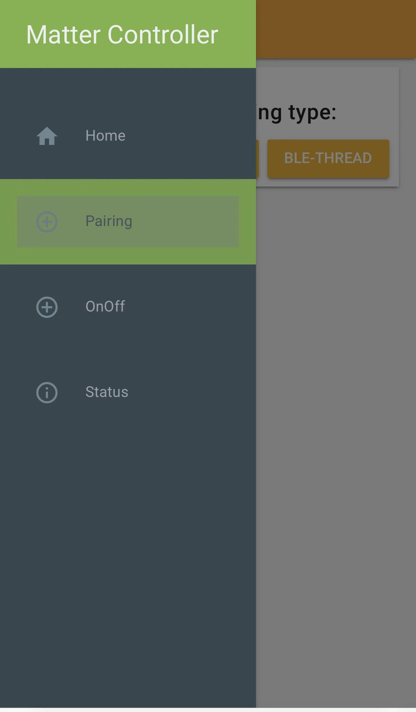
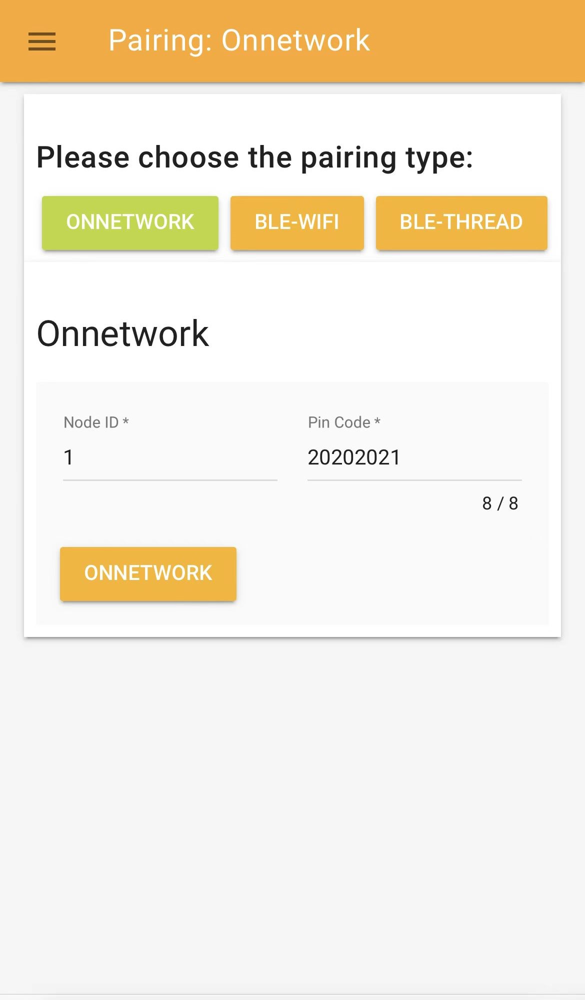
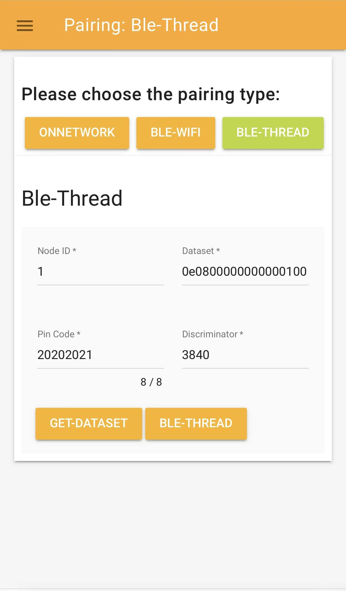
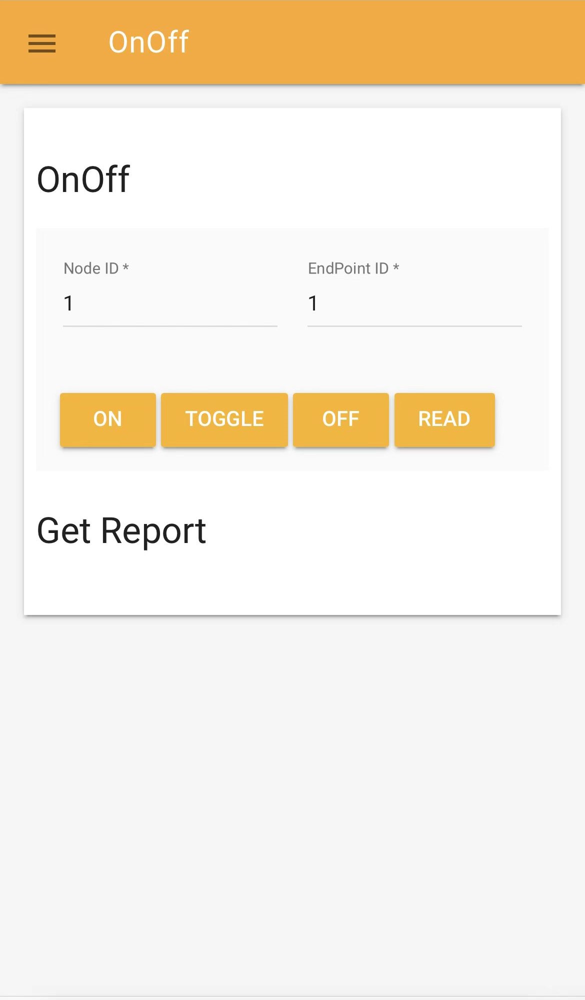
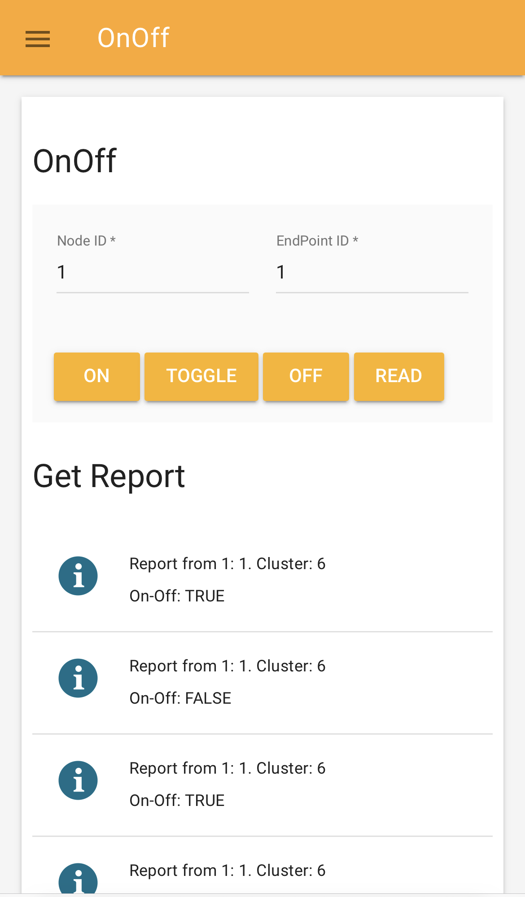

# Working with the chip-tool-web

The 'chip-tool-web' is a web-based graphical user interface (GUI) for the Matter controller, designed specifically for i.MX SoC customers. It provides an intuitive interface for commissioning Matter devices, sending Matter messages and performing other Matter-specific actions.

With the chip-tool-web, you can easily configure, manage and monitor Matter devices without the need to use complex command lines.

<hr>

-   [Source files](#source)
-   [Building and running the chip-tool-web](#building)
-   [Using chip-tool-web to commission a Matter device](#using)
-   [Additional Notes](#note)
<hr>

<a name="source"></a>

## Source files

You can find the source files for the chip-tool-web in the `${matter}/examples/chip-tool/webui` directory, which are separated into frontend and backend components. This allows easy customization and modification based on specific requirements and use cases.
<hr>

<a name="building"></a>

## Building and running the chip-tool-web

Before using the chip-tool-web, you must compile it from source on Linux (armv71/aarch64) or macOS.

> **Note:** To ensure compatibility, you should always build the chip-tool-web from the same revision of the `connectedhomeip` repository.

### Building the chip-tool-web

The steps to compile the chip-tool-web are the same as [How to build Matter application](https://github.com/nxp-imx/meta-matter/blob/master/README.md#how-to-build-matter-application), the only difference is the compilation command:
```
# Build the chip-tool-web example with the following command
$ NXP_CHIPTOOL_WITH_WEB=1 ./scripts/examples/imxlinux_example.sh examples/chip-tool/ out/chip-tool-web debug
```

After compilation, you will find two binaries, chip-tool and chip-tool-web, in the ${matter}/out/chip-tool-web/ folder. However, please note that the chip-tool binary in this folder may not work as expected. Therefore, it is recommended not to use the chip-tool binary located in the out/chip-tool-web directory.

### Running the chip-tool-web

#### Introduction

Before using `chip-tool-web`, make sure that the i.MX board is properly connected to the Internet.

#### Default Setup

The image built by `meta-matter` includes the `chip-tool` binary in the i.MX SOC `/usr/bin` directory, and all frontend files are already copied to `/usr/share/chip-tool-web/`. Therefore, to use `chip-tool-web`, you only need to copy the newly compiled `chip-tool-web` binary to the `/usr/bin` directory.

#### Custom Setup

If you want to specify a custom location for the frontend files, you can follow these steps:
- Copy the `frontend` file to the desired location:
    ```
    $ cp ${matter}/examples/chip-tool/webui/frontend $frontend_path
    ```
- Export the `CHIP_TOOL_WEB_FRONTEND` variable and set it to the path of the frontend files:
    ```
    $ export CHIP_TOOL_WEB_FRONTEND=$frontend_path
    ```
- If you want to make this variable persistent across sessions, add the above command to your shell configuration file (e.g., `~/.bashrc`).

#### Verification

After completing the setup, run the following command to verify that `chip-tool-web` is working properly:
```
$ chip-tool-web
```

If you see the following log: `CHIP:DL: CHIP task running`, everything is working fine.

#### Accessing the chip-tool-web

The `chip-tool-web` can run on a variety of devices, including desktops, laptops, and mobile devices. To access the `chip-tool-web`, follow these steps:

- Open a web browser (such as Chrome, IE, Safari, etc.) on the device you want to use.
- Enter the IP address of the i.MX board followed by `:8889` in the address bar of the browser. You can find the IP address of the i.MX board by running the `ifconfig` command on the board.
- You will see the `chip-tool-web` home page. Follow the instructions in the [section](#using-chip-tool-web-to-commission-a-matter-device) to proceed.

#### Example of opening on an iPhone

Here is an example of opening `chip-tool-web` on an Apple mobile phone using Safari:
 
<hr>

> **Note:** The network connected to the running device must be on the same segment as the i.MX device.

<a name="using"></a>

## Using chip-tool-web to commission a Matter device

This section provides instructions for using chip-tool-web to commission Matter devices, with a focus on the chip-lighting-app application clusters on i.MX MPU platforms.

It should be noted that while chip-tool-web provides a graphical user interface (GUI) for executing commands through buttons and other visual controls, it does not completely replace the chip-tool command line tool. Users can still use the chip-tool command line tool if they prefer or need to, but chip-tool-web provides an additional option for interacting with Matter devices. The following sections will provide a detailed overview of the features currently available in chip-tool-web.

An official Matter document explaining how to use chip-tool as a Matter controller, can be found [here](https://github.com/project-chip/connectedhomeip/blob/master/docs/guides/chip_tool_guide.md).

For more information on how to use Matter applications on i.MX MPU platforms, see the [NXP Matter binaries guide](./nxp_mpu_matter_binaries.md).

### Using Interactive mode

The chip-tool offers two modes of operation: `Single Command Mode` and `Interactive Mode`, each with unique features and appropriate use cases. For detailed information about these modes, please refer to the official documentation available at [Interactive mode versus single-command mode](
https://github.com/project-chip/connectedhomeip/blob/master/docs/guides/chip_tool_guide.md#interactive-mode-versus-single-command-mode).

It should be noted that chip-tool-web uses the `Interactive Mode` to allow users to conveniently send multiple commands through the web interface and to improve the management of Matter devices.

### Pairing a Matter device

To access the `Pairing` feature in chip-tool-web, first open the navigation bar and select `Pairing`. This will display the following menu interface:
 

On the pairing page, there are three buttons to select the type of pairing: `ONNETWORK`, `BLE-WIFI`, and `BLE-THREAD`. These buttons allow the user to select the different pairing modes to use. After clicking the appropriate button, the user interface for the selected pairing type will appear.

The remainder of this section provides a detailed overview of each of these pairing methods.

#### Pairing a device over IP

Click on the `ONNETWORK` pairing type selection button, the display interface will be as shown below.
 

If you enter the correct parameters and click the `onnetwork` button on this interface, the following command will be triggered to discover devices and attempt to pair with the first discovered one using the provided setup code:

```
$ chip-tool pairing onnetwork <node_id> <pin_code>
```

In this command:

-   _<node_id\>_ is the user-defined ID of the node being commissioned.
-   _<pin_code\>_ is device specific _setup PIN code_ determined in the [step](https://github.com/project-chip/connectedhomeip/blob/master/docs/guides/chip_tool_guide.md#step-5-determine-matter-devices-discriminator-and-setup-pin-code) and used to discover the device.

#### Pairing a device over Ble-WiFi

Click on the `BLE-WIFI` pairing type selection button, the display interface will be as shown below.
 

If you enter the correct parameters and click the `BLE-WIFI` button on this interface, the following command will be triggered to commission the device to the existing WiFI network:
```
$ chip-tool pairing ble-wifi <node_id> <ssid> <password> <pin_code> <discriminator>
```
In this command:

-   _<node_id\>_ is the user-defined ID of the node being commissioned.
-   _<ssid\>_ and _<password\>_ are credentials determined in the [step](https://github.com/project-chip/connectedhomeip/blob/master/docs/guides/chip_tool_guide.md#obtaining-wi-fi-network-credentials).
-   _<pin_code\>_ and _<discriminator\>_ are device-specific keys determined in the [step](https://github.com/project-chip/connectedhomeip/blob/master/docs/guides/chip_tool_guide.md#step-5-determine-matter-devices-discriminator-and-setup-pin-code).

For example:
```
chip-tool pairing ble-wifi 1 xyz secret 20202021 3840
```
If you prefer the hexadecimal format, add `hex:` prefix when entering ssid, password. For example:

```
$ chip-tool pairing ble-wifi <node_id> hex:<ssid> hex:<password> <pin_code> <discriminator>
```

> **Note:** The _<node_id>_ can be provided as a hexadecimal value with the `0x` prefix.

#### Pairing a device over Ble-Thread

Click on the `BLE-THREAD` pairing type selection button, the display interface will be as shown below.
 

If you enter the correct parameters and click the `BLE-Thread` button on this interface, the following command will be triggered to commission the device to the existing Thread network:
```
$ chip-tool pairing ble-thread <node_id> hex:<operational_dataset> <pin_code> <discriminator>
```
In this command:

-   _<node_id\>_ is the user-defined ID of the node being commissioned.
-   _<operational_dataset\>_ is the Operational Dataset determined in the [step](https://github.com/project-chip/connectedhomeip/blob/master/docs/guides/chip_tool_guide.md#obtaining-thread-network-credentials).
-   _<pin_code\>_ and _<discriminator\>_ are device-specific keys determined in the [step](https://github.com/project-chip/connectedhomeip/blob/master/docs/guides/chip_tool_guide.md#step-5-determine-matter-devices-discriminator-and-setup-pin-code).

> **Note:** When entering the _<operational_dataset>_,  there is no need to add the `hex:` prefix, as this is already added by default in the chip-tool-web backend.
>

To obtain the Thread network credentials, you can either form the OpenThread network manually by following the instructions provided in the [Configure OpenThread Network](./nxp_mpu_matter_binaries.md#configure-openthread-network), or via otbr-web.

Once the network has been formed, you can retrieve the Thread network credentials by clicking the `GET-DATASET` button in chip-tool-web instead of manually typing the `ot-ctl dataset active -x` command.

### Controling a Matter device

Once the pairing process is complete, the Matter device is successfully commissioned to the network. For the lighting application, the On/Off clusters are implemented in chip-tool-web, allowing you to control the end devices using the `onoff` cluster commands.

To access the `onoff` function in the chip-tool-web, first open the navigation bar and select `OnOff`. The following interface will be displayed:
 

**Commands list supported for the onoff cluster:**
```bash

  +-------------------------------------------------------------------------------------+
  | Commands:                                                                           |
  +-------------------------------------------------------------------------------------+
  | * off                                                                               |
  | * on                                                                                |
  | * toggle                                                                            |
  | * read                                                                              |
  +-------------------------------------------------------------------------------------+
```
Use the following buttons to control or read the status of the `OnOff` attribute (e.g. visualized by the LED status):

-   Use the `ON` button to trigger the following command to turn on the state of the OnOff attribute:
    ```
    $ chip-tool onoff on <node_id> <endpoint_id>
    ```
-   Use the `TOGGLE` button to trigger the following command to toggle the state of the OnOff attribute:
    ```
    $ chip-tool onoff toggle <node_id> <endpoint_id>
    ```
-   Use the `OFF` button to trigger the following command to turn off the state of the OnOff attribute:
    ```
    $ chip-tool onoff off <node_id> <endpoint_id>
    ```
-   Use the `READ` button to trigger the following command to read the state of the OnOff attribute state:
    ```
    $ chip-tool onoff read on-off <node_id> <endpoint_id>
    ```
    In below commands:

    -   _<node_id\>_ is the user-defined ID of the commissioned node.
    -   _<endpoint_id\>_ is the ID of the endpoint with OnOff cluster implemented.

The following will introduce the content of `READ` button in detail.

### Getting the report

After clicking the `READ` button to trigger the corresponding command, a report will later be displayed in the `Get Report` section of the page. The page does not clear previously generated reports and always displays the latest report at the top of the list.

#### Report Format

The report is output in text format with the following structure:
```
Report from ${nodeid}:${endpoint}. Cluster:${cluster}
${attribute}:${value}
```
#### Report Elements

- ${nodeid}: The nodeid of the device.
- ${endpoint}: The endpoint of the device.
- ${cluster}: The cluster name to which the device belongs.
- ${attribute}: The name of the attribute being reported. In this case, the default attribute is `On-Off`.
- ${value}: The value of the attribute. There are two possible values: `TRUE` or `FALSE`. `TRUE` indicates that the light is on, while `FALSE` indicates that the light is off.

#### Report Examples

The following is an example of a multiple read of a device whose nodeid and endpoint are both 1.
 

<hr>

<a name="note"></a>

## Additional Notes

- Deleting the `/tmp/chip_tool_config.ini` file and any other `.ini` files in the `/tmp` directory may help to resolve problems caused by outdated configuration.
Running `rm -rf /tmp/chip_*` will remove these files. This will allow the chip-tool-web to rebuild its configuration files from scratch.

- The timeout for all buttons in the chip-tool-web that execute commands is set to 60 seconds. During the command execution process, the interface will display the command execution waiting effect. Please wait patiently for the command to finish executing and return a result of `success` or `failed`.

- In general, commands related to `Pairing` may take longer to execute, while commands related to `OnOff` functionality will execute faster. If a pairing command takes a long time to execute and returns with `failed`, please check that the device configuration follows the [documentation](./nxp_mpu_matter_binaries.md). Also, try pairing again after running `rm -rf /tmp/chip_*`.

- The chip-tool-web supports commissioning multiple devices at the same time. However, in the current version, only one device can be connected at a time in each pairing mode. Therefore, the current version of chip-tool-web can pair and control three devices at the same time. Note that you should not run `rm -rf /tmp/chip_*` while commissioning multiple devices at once, as this will erase the useful information of the successfully paired devices.

- New features are still being developed and expanded.