# Working with the chip-tool-web

The 'chip-tool-web' is a web-based graphical user interface (GUI) for the Matter controller, designed specifically for i.MX SoC customers. It provides an intuitive interface for commissioning Matter devices, sending Matter messages and performing other Matter-specific actions.

With the chip-tool-web, you can easily configure, manage and monitor Matter devices without the need to use complex command lines.

<hr>

-   [Source files](#source)
-   [Building and running the chip-tool-web](#building)
-   [Using chip-tool-web to commission a Matter device](#using)
-   [Controlling a Matter device OnOff cluster](#onoff)
-   [Opening the commissioning window for the commissioned Matter device](#multiadmin)
-   [Subscribing a Matter device OnOff cluster](#subscribe)
-   [Getting status for a commmissioned Matter device](#getstatus)
-   [Binding for light and switch Matter device](#binding)
-   [Controlling a Matter device mediaplayback cluster](#media)
-   [Controlling a Matter device Energy EVSE Cluster](#eevse)
-   [Additional Notes](#note)
<hr>

<a name="source"></a>

## Source files

You can find the source files for the chip-tool-web in the `${matter}/examples/chip-tool/webui` directory, which are separated into frontend and backend components. This allows easy customization and modification based on specific requirements and use cases.
<hr>

<a name="building"></a>

## Building and running the chip-tool-web

Before using the chip-tool-web, you must compile it from source on Linux (armv71/aarch64) or macOS.

> **Note:** To ensure compatibility, you should always build the chip-tool-web from the same revision of the `connectedhomeip` repository.

### Building the chip-tool-web

The steps to compile the chip-tool-web are the same as [How to build Matter application](https://github.com/nxp-imx/meta-nxp-connectivity/blob/master/README.md#how-to-build-matter-application)

After compilation, you will find two binaries, chip-tool and chip-tool-web, in the ${matter}/out/chip-tool-web/ folder. However, please note that the chip-tool binary in this folder may not work as expected. Therefore, it is recommended not to use the chip-tool binary located in the out/chip-tool-web directory.

### Running the chip-tool-web

#### Introduction

Before using `chip-tool-web`, make sure that the i.MX board is properly connected to the Internet.

#### Default Setup

The image built by `meta-nxp-connectivity` includes the `chip-tool` binary in the i.MX SOC `/usr/bin` directory, and all frontend files are already copied to `/usr/share/chip-tool-web/`. Therefore, to use `chip-tool-web`, you only need to copy the newly compiled `chip-tool-web` binary to the `/usr/bin` directory.

#### Custom Setup

If you want to specify a custom location for the frontend files, you can follow these steps:
- Copy the `frontend` file to the desired location:
    ```
    $ cp ${matter}/examples/chip-tool/webui/frontend $frontend_path
    ```
- Export the `CHIP_TOOL_WEB_FRONTEND` variable and set it to the path of the frontend files:
    ```
    $ export CHIP_TOOL_WEB_FRONTEND=$frontend_path
    ```
- If you want to make this variable persistent across sessions, add the above command to your shell configuration file (e.g., `~/.bashrc`).

#### Verification

After completing the setup, run the following command to verify that `chip-tool-web` is working properly:
```
$ chip-tool-web
```

If you see the following log: `CHIP:DL: CHIP task running`, everything is working fine.

#### Accessing the chip-tool-web

The `chip-tool-web` can run on a variety of devices, including desktops, laptops, and mobile devices. To access the `chip-tool-web`, follow these steps:

- Open a web browser (such as Chrome, IE, Safari, etc.) on the device you want to use.
- Enter the IP address of the i.MX board followed by `:8889` in the address bar of the browser. You can find the IP address of the i.MX board by running the `ifconfig` command on the board.
- You will see the `chip-tool-web` home page. Follow the instructions in the [section](#using-chip-tool-web-to-commission-a-matter-device) to proceed.

#### Example of opening on an iPhone

Here is an example of opening `chip-tool-web` on an Apple mobile phone using Safari:


<hr>

> **Note:** The network connected to the running device must be on the same segment as the i.MX device.

<a name="using"></a>

## Using chip-tool-web to commission a Matter device

This section provides instructions for using chip-tool-web to commission Matter devices, with a focus on the chip-lighting-app application clusters on i.MX MPU platforms.

It should be noted that while chip-tool-web provides a graphical user interface (GUI) for executing commands through buttons and other visual controls, it does not completely replace the chip-tool command line tool. Users can still use the chip-tool command line tool if they prefer or need to, but chip-tool-web provides an additional option for interacting with Matter devices. The following sections will provide a detailed overview of the features currently available in chip-tool-web.

An official Matter document explaining how to use chip-tool as a Matter controller, can be found [here](https://github.com/project-chip/connectedhomeip/blob/master/docs/guides/chip_tool_guide.md).

For more information on how to use Matter applications on i.MX MPU platforms, see the [NXP Matter demos guide](./nxp_mpu_matter_demos.md).

### Using Interactive mode

The chip-tool offers two modes of operation: `Single Command Mode` and `Interactive Mode`, each with unique features and appropriate use cases. For detailed information about these modes, please refer to the official documentation available at [Interactive mode versus single-command mode](
https://github.com/project-chip/connectedhomeip/blob/master/docs/guides/chip_tool_guide.md#interactive-mode-versus-single-command-mode).

It should be noted that chip-tool-web uses the `Interactive Mode` to allow users to conveniently send multiple commands through the web interface and to improve the management of Matter devices.

### Pairing a Matter device

To access the `Pairing` feature in chip-tool-web, first open the navigation bar and select `Pairing`. This will display the following menu interface:

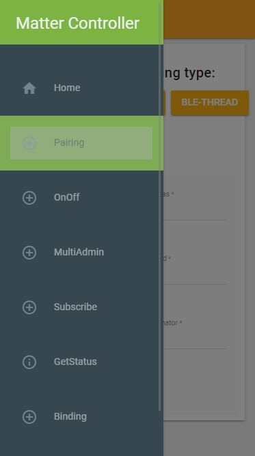

On the pairing page, there are three buttons to select the type of pairing: `ONNETWORK`, `BLE-WIFI`, and `BLE-THREAD`. These buttons allow the user to select the different pairing modes to use. After clicking the appropriate button, the user interface for the selected pairing type will appear.

The remainder of this section provides a detailed overview of each of these pairing methods.

#### Pairing a device over IP

Click on the `ONNETWORK` pairing type selection button, the display interface will be as shown below.

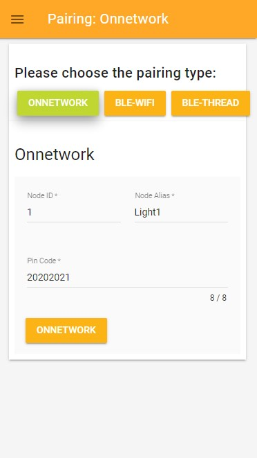

You should specify a node alias for the node ID so that you can identify it by node alias. If you enter the correct parameters and click the `onnetwork` button on this interface, the following command will be triggered to discover devices and attempt to pair with the first discovered one using the provided setup code:

```
$ chip-tool pairing onnetwork-commissioning-mode <node_id> <pin_code>
```

In this command:

-   _<node_id\>_ is the user-defined ID of the node being commissioned.
-   _<pin_code\>_ is device specific _setup PIN code_ determined in the [step](https://github.com/project-chip/connectedhomeip/blob/master/docs/guides/chip_tool_guide.md#step-5-determine-matter-devices-discriminator-and-setup-pin-code) and used to discover the device.

#### Pairing a device over Ble-WiFi

Click on the `BLE-WIFI` pairing type selection button, the display interface will be as shown below.

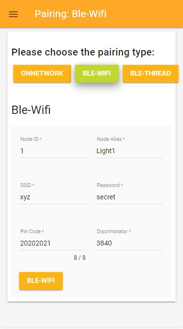

You should specify a node alias for the node ID so that you can identify it by node alias. If you enter the correct parameters and click the `BLE-WIFI` button on this interface, the following command will be triggered to commission the device to the existing WiFI network:
```
$ chip-tool pairing ble-wifi <node_id> <ssid> <password> <pin_code> <discriminator>
```
In this command:

-   _<node_id\>_ is the user-defined ID of the node being commissioned.
-   _<ssid\>_ and _<password\>_ are credentials determined in the [step](https://github.com/project-chip/connectedhomeip/blob/master/docs/guides/chip_tool_guide.md#obtaining-wi-fi-network-credentials).
-   _<pin_code\>_ and _<discriminator\>_ are device-specific keys determined in the [step](https://github.com/project-chip/connectedhomeip/blob/master/docs/guides/chip_tool_guide.md#step-5-determine-matter-devices-discriminator-and-setup-pin-code).

For example:
```
chip-tool pairing ble-wifi 1 xyz secret 20202021 3840
```
If you prefer the hexadecimal format, add `hex:` prefix when entering ssid, password. For example:

```
$ chip-tool pairing ble-wifi <node_id> hex:<ssid> hex:<password> <pin_code> <discriminator>
```
<hr>

> **Note:** The _<node_id>_ can be provided as a hexadecimal value with the `0x` prefix.

#### Pairing a device over Ble-Thread

Click on the `BLE-THREAD` pairing type selection button, the display interface will be as shown below.

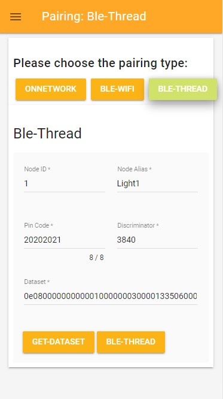

You should specify a node alias for the node ID so that you can identify it by node alias. If you enter the correct parameters and click the `BLE-Thread` button on this interface, the following command will be triggered to commission the device to the existing Thread network:
```
$ chip-tool pairing ble-thread <node_id> hex:<operational_dataset> <pin_code> <discriminator>
```
In this command:

-   _<node_id\>_ is the user-defined ID of the node being commissioned.
-   _<operational_dataset\>_ is the Operational Dataset determined in the [step](https://github.com/project-chip/connectedhomeip/blob/master/docs/guides/chip_tool_guide.md#obtaining-thread-network-credentials).
-   _<pin_code\>_ and _<discriminator\>_ are device-specific keys determined in the [step](https://github.com/project-chip/connectedhomeip/blob/master/docs/guides/chip_tool_guide.md#step-5-determine-matter-devices-discriminator-and-setup-pin-code).

<hr>

> **Note:** When entering the _<operational_dataset>_,  there is no need to add the `hex:` prefix, as this is already added by default in the chip-tool-web backend.
>

To obtain the Thread network credentials, you can either form the OpenThread network manually by following the instructions provided in the [Configure OpenThread Network](./nxp_mpu_matter_demos.md#configure-openthread-network), or via otbr-web.

Once the network has been formed, you can retrieve the Thread network credentials by clicking the `GET-DATASET` button in chip-tool-web instead of manually typing the `ot-ctl dataset active -x` command.

<a name="onoff"></a>

## Controlling a Matter device OnOff cluster

Once the pairing process is complete, the Matter device is successfully commissioned to the network. For the lighting application, the On/Off clusters are implemented in chip-tool-web, allowing you to control the end devices using the `onoff` cluster commands.

To access the `onoff` function in the chip-tool-web, first open the navigation bar and select `OnOff`. The following interface will be displayed:

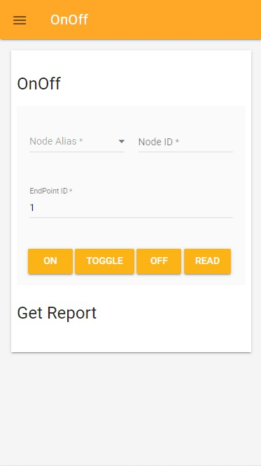

**Commands list supported for the onoff cluster:**
```bash

  +-------------------------------------------------------------------------------------+
  | Commands:                                                                           |
  +-------------------------------------------------------------------------------------+
  | * off                                                                               |
  | * on                                                                                |
  | * toggle                                                                            |
  | * read                                                                              |
  +-------------------------------------------------------------------------------------+
```
Use the following buttons to control or read the status of the `OnOff` attribute (e.g. visualized by the LED status):

-   Use the `ON` button to trigger the following command to turn on the state of the OnOff attribute:
    ```
    $ chip-tool onoff on <node_id> <endpoint_id>
    ```
-   Use the `TOGGLE` button to trigger the following command to toggle the state of the OnOff attribute:
    ```
    $ chip-tool onoff toggle <node_id> <endpoint_id>
    ```
-   Use the `OFF` button to trigger the following command to turn off the state of the OnOff attribute:
    ```
    $ chip-tool onoff off <node_id> <endpoint_id>
    ```
-   Use the `READ` button to trigger the following command to read the state of the OnOff attribute state:
    ```
    $ chip-tool onoff read on-off <node_id> <endpoint_id>
    ```
    In above commands:

    -   _<node_id\>_ is the user-defined ID of the commissioned node.
    -   _<endpoint_id\>_ is the ID of the endpoint with OnOff cluster implemented.

The following will introduce the content of `READ` button in detail.

### Getting the report

After clicking the `READ` button to trigger the corresponding command, a report will later be displayed in the `Get Report` section of the page. The page does not clear previously generated reports and always displays the latest report at the top of the list.

#### Report Format

The report is output in text format with the following structure:
```
Report from ${nodealias} ${nodeid}:${endpoint}. Cluster:${cluster}
${attribute}:${value}
```

#### Report Elements
<a name="onoff-report-elements"></a>

- ${nodealias}: The node alias of the device.
- ${nodeid}: The nodeid of the device.
- ${endpoint}: The endpoint of the device.
- ${cluster}: The cluster name to which the device belongs.
- ${attribute}: The name of the attribute being reported. In this case, the default attribute is `On-Off`.
- ${value}: The value of the attribute. There are two possible values: `TRUE` or `FALSE`. `TRUE` indicates that the light is on, while `FALSE` indicates that the light is off.

#### Report Examples

The following is an example of a multiple read of a device whose nodealias is Light and nodeid and endpoint are both 1.

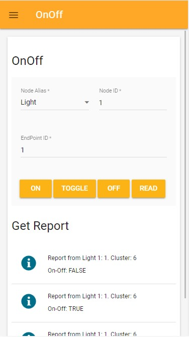

<a name="multiadmin"></a>

## Opening the commissioning window for the commissioned Matter device

Multi-admin feature allows you to join Matter device to multiple Matter fabrics and have multiple different Matter administrators administer it. Chip-tool-web supports the Basic Commissioning Method to open the commissioning window of i.MX Matter device for a new administrator from another fabric.

To access the `Multi-admin` function in the chip-tool-web, first open the navigation bar and select `MultiAdmin`. The following interface will be displayed:

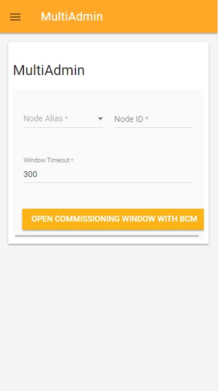

Select the node alias of the paired Matter device, and the page will automatically fill in the corresponding node ID. Then enter the value of windows timeout and click the `OPEN COMMISSIONING WINDOW` button to trigger the Open Commissioning window:
```
$ chip-tool pairing open-commissioning-window <node_id> <option> <window_timeout> <iteration> <discriminator>
```
In this command:

-   _<node_id\>_ is the ID of the node that should open commissioning window.
-   _<option\>_ is equal to `0` for Basic Commissioning Method.
-   _<window_timeout\>_ is time in seconds, before the commissioning window
    closes.
-   _<iteration\>_ is number of PBKDF iterations to use to derive the PAKE
    verifier.
-   _<discriminator\>_ is device specific discriminator determined during
    commissioning.

<hr>

> **Note:** The _<iteration\>_ and _<discriminator\>_ values are ignored because the _<option\>_ is set to 0.

You can then commission the Matter device to a new fabric using another instance of the CHIP tool by below cmd or via the onnetwork pairing.
```
$ chip-tool pairing code <node_id> <payload>
```
In this command:

-   _<node_id\>_ is the user-defined ID of the commissioned node.
-   _<payload\>_ is the the QR code payload or a manual pairing code generated by the first commissioner instance when opened commissioning window. Since you are using the Basic Commissioning Method to open commissioning window, the manual pairing code should be `34970112332`.

<a name="subscribe"></a>

## Subscribing a Matter device OnOff cluster

Subscribing to an attribute lets you mirror the state of the attribute as it changes in the Matter network. Chip-tool-web support for subscribing to the `on-off` attribute of the `onoff` cluster.

To access the `Subscribe` function in the chip-tool-web, first open the navigation bar and select `Subscribe`. The following interface will be displayed:

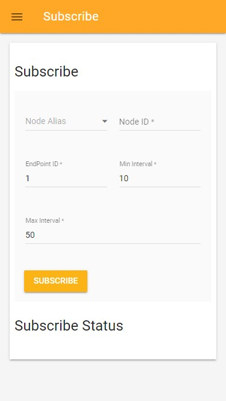

Select the node alias of the paired Matter device, and the page will automatically fill in the corresponding node ID. Then enter the value of windows timeout and click the `SUBSCRIBE` button to trigger the subscribe command:
```
$ chip-tool onoff subscribe on-off <min-interval> <max-interval> <node_id> <endpoint_id>
```
In this command:

- _<min-interval\>_ specifies the minimum number of seconds that must elapse since the last report for the server to send a new report.
- _<max-interval\>_ specifies the number of seconds that must elapse since the last report for the server to send a new report.
- _<node-id\>_ is the user-defined ID of the commissioned node.
- _<endpoint_id\>_ is the ID of the endpoint where the `onoff` cluster is implemented.

#### Subscribe Report Format

The subscribe report with the `on-off` attribute is updated on `Subsribe Status` section when it changes. The page does not clear previously generated reports and always displays the latest report at the top of the list.
The following is an example of the subscription statue of a device whose nodealias is Light and whose nodeid and endpoint are both 1.


The report is output in text format with the following structure:
```
Subscribe Report from ${nodealias} ${nodeid}:${endpoint}. Cluster:${cluster}
${attribute}:${value}
```
The elements of the subscribe report are the same as those of the [OnOff read report](#onoff-report-elements).

<hr>

> **Note:** Because subscribe must maintain the subscription status in interactive mode, please do not enter any other commands in the console of the i.MX Matter devices when the chip-tool-web initiates the subscribe command, as this may interrupt the update of the subscribe report.

<a name="getstatus"></a>

## Getting status for a commmissioned Matter device

Chip-tool-web stores the node ID and node alias of the paired device in the chip_tool_config.web.ini file. If `TMPDIR` is not set, the chip_tool_config.web.ini file is located in the `/tmp/` directory. If `export TMPDIR=${tmpfir}` is set, it is stored in the `${tmpfir}` directory. You can see the node ID and node alias of all paired nodes in `GetStatus` tab, and you can delete the paired node information on this page so that you will no longer see information about that node in the node alias selection on other tabs.

To access the `GetStatus` function in the chip-tool-web, first open the navigation bar and select `GetStatus`. The following interface will be displayed:

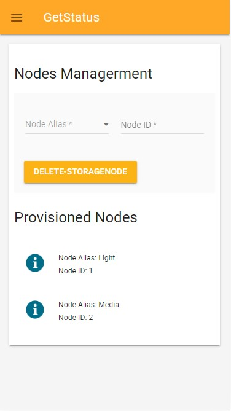

Select the node alias of the paired Matter device, and the page will automatically fill in the corresponding node ID. Then click the `DELETE-STORAGENODE` button to delete the paired node information, then this node will not be displayed in the chip-tool-web front page.

#### Node Information Format

The provisioned nodes is displayed in text format with the following structure:
```
Node Alias: ${nodealias}
node ID: ${nodeid}
```
In the structure above:
- ${nodealias}: The node alias of the device.
- ${nodeid}: The nodeid of the device.

<a name="binding"></a>

## Binding for light and switch Matter device

Binding describes a relationship between the device that contains the binding cluster and the end device. The chip-tool-web supports binding a light in one light_switch_combo device to the switch in another light_switch_combo device, allowing the light in another device to be controlled by the switch of one device.

To access the `Binding` function in the chip-tool-web, first open the navigation bar and select `Binding`. The following interface will be displayed:

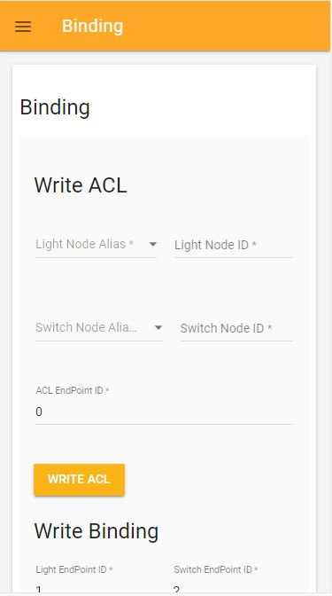

### Write ACL

First, the light_switch_combo application should run properly on the K32W Matter device, and then use the chip-tool-web ble-thread pairing method to pair with two light_switch_combo devices separately.

Two light-switch_combo devices, one used as the switch device and the other used as the light device. Before binding, the access control list must be written. Therefore, in the `Light Node Alias` section, select the node alias that you want to use as the light device. In the `Switch Node Alias` section, select the node alias you want to use as the switch device, and they corresponding node IDs will be filled in automatically. `ACL EndPoint ID` is recommended to use endpoint `0`. Then click the `WRITE ACL` button to trigger write acl command like below.
```
chip-tool accesscontrol write acl <acl_data> <node_id> <endpoint_id>
```
In this command:

-   _<acl_data\>_ is the ACL data formatted as a JSON array. Here is the `'[{"fabricIndex": 1, "privilege": 5, "authMode": 2, "subjects": [112233], "targets": null },{"fabricIndex": 1, "privilege": 3, "authMode": 2, "subjects": [<Switch Node Id>], "targets": null }]'`.
-   _<node_id\>_ is the ID of the node that is going to receive ACL. Here is <Light node ID\>..
-   _<endpoint_id\>_ is the ID of the endpoint on which the `accesscontrol`
    cluster is implemented. 0 means all enpoints.

For more details, you can refer to [access control guide](https://github.com/project-chip/connectedhomeip/blob/master/docs/guides/access-control-guide.md).

### Write Binding

After trigger the write access list command, you can click the `WRITE BINDING` button to binding the Light and Switch device， it will trigger the command:
```
$ ./chip-tool binding write binding <binding_data> <node_id> <endpoint_id>
```
In this command:

-   _<binding_data\>_ is the binding data formatted as a JSON array. Here is `[{"fabricIndex": 1, "node": <Light NodeId>, "endpoint": <Light EndPoint ID>, "cluster": 6}]'`.
-   _<node_id\>_ is the ID of the node that is going to receive the binding. Here is <Switch node ID\>.
-   _<endpoint_id\>_ is the ID of the endpoint on which the `binding` cluster is
    implemented. Here is the <Switch EndPoint ID\> of the switch device.

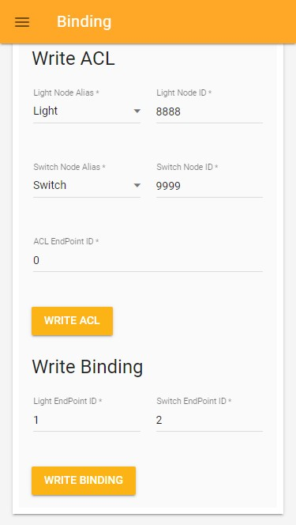

After the binding command is successfully executed, press SW2 two times on the device acting as Switch to register the binding entry, and then you can control the light (D3) on the peer device (light device) just by pressing SW2/SW3.

<a name="media"></a>

## Controlling a Matter device mediaplayback cluster

The i.MX Matter supports nxp-media-app from the 2023 q4 release, you can control the media player and read information through the chip-tool-web.
Before controlling media app, you need to place media files in the `/home/root/media` folder of the nxp-media-app device.

To access the `MediaControl` function in the chip-tool-web, first open the navigation bar and select `MediaControl`. The following interface will be displayed:

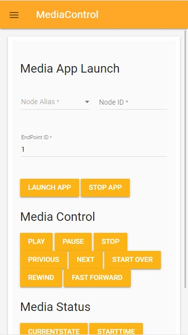

### Launch or Stop app

Select the node alias of the paired Matter nxp-media-app device, and the page will automatically fill in the corresponding node ID. Then enter the Endpoint ID and click the `LAUNCH APP` or `STOP APP` button to launch or stop the app by below commands.
```
$ chip-tool applicationlauncher launch-app <launcher_data> <node_id> <endpoint_id>
$ chip-tool applicationlauncher stop-app <launcher_data> <node_id> <endpoint_id>
```

In this command:
-   _<launcher_data\>_ is the Launcher data formatted as a JSON array. Here is the `'{"catalogVendorID": 123, "applicationID": "exampleid"}'`.
-   _<node_id\>_ is the ID of the node that is going to receive launcher data.
-   _<endpoint_id\>_ is the ID of the endpoint on which the `applicationlauncher`
    cluster is implemented.

### Media Control

Use the following buttons in the `Media Control` section to control the status of the `mediaplayback` attribute:

-   Use the `PLAY` button to trigger the following command to change the current media playback state to play:
    ```
    $ chip-tool mediaplayback play <node_id> <endpoint_id>
    ```
-   Use the `PAUSE` button to trigger the following command to change the current media playback state to pause:
    ```
    $ chip-tool mediaplayback pause <node_id> <endpoint_id>
    ```
-   Use the `STOP` button to trigger the following command to change the current media playback state to stop:
    ```
    $ chip-tool mediaplayback stop <node_id> <endpoint_id>
    ```
-   Use the `PRIVIOUS` button to trigger the following command to play privious media:
    ```
    $ chip-tool mediaplayback privious <node_id> <endpoint_id>
    ```
-   Use the `NEXT` button to trigger the following command to play next media:
    ```
    $ chip-tool mediaplayback next <node_id> <endpoint_id>
    ```
-   Use the `START OVER` button to trigger the following command to start over the media being played:
    ```
    $ chip-tool mediaplayback start-over <node_id> <endpoint_id>
    ```
-   Use the `REWIND` button to trigger the following command to rewind the current media, and then you can use the `PLAY` button to play the rewinded media:
    ```
    $ chip-tool mediaplayback rewind <node_id> <endpoint_id>
    ```
-   Use the `FAST FORWARD` button to trigger the following command to fast forward the current media:
    ```
    $ chip-tool mediaplayback fast-forward <node_id> <endpoint_id>
    ```
    In above commands:

    -   _<node_id\>_ is the user-defined ID of the commissioned node.
    -   _<endpoint_id\>_ is the ID of the endpoint with `mediaplayback` cluster implemented.

### Media Status

Use the following buttons to read the status of the `mediaplayback` attribute in the `Media Status` section. The page and results are shown in the following:

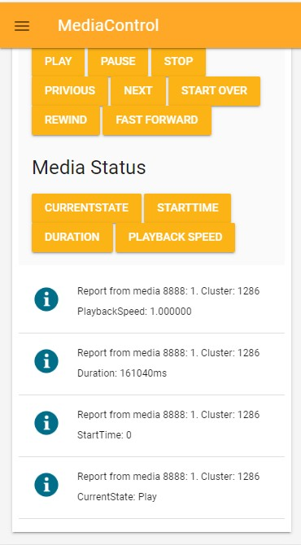

-   Use the `CURRENTSTATE` button to trigger the following command to read the current state of media playback:
    ```
    $ chip-tool mediaplayback read current-state <node_id> <endpoint_id>
    ```
-   Use the `STARTTIME` button to trigger the following command to read the start time of the currently playing media:
    ```
    $ chip-tool mediaplayback read start-time <node_id> <endpoint_id>
    ```
-   Use the `DURATION` button to trigger the following command to read the duration of the currently playing media:
    ```
    $ chip-tool mediaplayback read duration <node_id> <endpoint_id>
    ```
-   Use the `PLAYBACK SPEED` button to trigger the following command to read the playback speed of the currently playing media:
    ```
    $ chip-tool mediaplayback read playback-speed <node_id> <endpoint_id>
    ```
In above commands:

-   _<node_id\>_ is the user-defined ID of the commissioned node.
-   _<endpoint_id\>_ is the ID of the endpoint with mediaplayback cluster implemented.

#### Report Format

The media read report is output in text format with the following structure:
```
Report from ${nodealias} ${nodeid}:${endpoint}. Cluster:${cluster}
${attribute}:${value}
```
In the structure above,

- ${nodealias}: The node alias of the device.
- ${nodeid}: The nodeid of the device.
- ${endpoint}: The endpoint of the device.
- ${cluster}: The cluster name to which the device belongs.
- ${attribute}: The name of the attribute being reported. In this case, the default attributes are  `CurrentState`, `StartTime`, `Duration`, `PlatbackSpeed`.
- ${value}: The value of the attribute. There are three possible values for `CurrentState`: `Play`, `Pause`, `Stop`. The value of start time always be `0`. The value of `Duration` is currently playing media's duration. There are five possible values for `PlatbackSpeed`: `1.000000`, `2.000000`, `4.000000`, `8.000000`, `10.000000`.

<a name="eevse"></a>

## Controlling a Matter device Energy EVSE Cluster

***Note: To perform EEVSE control related operations on the chip-tool-web, relevant parameters must be added. For example, run the application with the command "$chip-energy-management-app -- enable-key 000102030405070708090a0b0c0d0e0f", and then perform the onnetwork pairing operation on the chip-tool-web.***

Once the pairing process is complete, the Matter device is successfully commissioned to the network. For the chip-energy-management-app, the EEVSE clusters are implemented in chip-tool-web, allowing you to control the end devices using the `energyevse` cluster commands.

To access the `energyevse` function in the chip-tool-web, first open the navigation bar and select `EevseControl`. The following interface will be displayed:

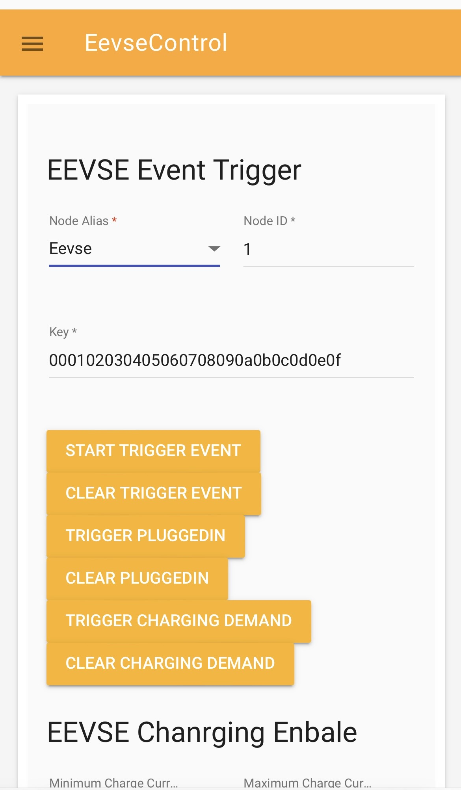

### Event Trigger

Select the node alias of the paired Matter chip-energy-management-app device, and the page will automatically fill in the corresponding node ID. Then enter the Endpoint ID and click the `TRIGGER` or `CLEAR` button to trigger or clear the simulated event. 

- The `START TRIGGER EVENT` button is used to simulate a start event as the basis for triggering subsequent simulated events.
- The `TRIGGER PLUGGEDIN` button is used to simulate a plugged-in event. Indicates that electric vehicles is connected to the charging station. This event must be triggered after a start event has-been triggered.
- The `TRIGGER CHARGING DEMAND` button is used to simulate a charging demand event. Indicates that electric vehicles have a charging requirement. This event must be triggered after a plugged-in event has-been triggered.
- The `CLEAR TRIGGER EVENT` button is used to clear the simulated start event.
- The `CLEAR PLUGGEDIN` button is used to clear the simulated pluggedin event.
- The `CLEAR CHARGING DEMAND` button is used to clear the simulated charging demand event.

When simulating events, the principle of "last trigger, first clear" should be used, e.g. the order should be: `START TRIGGER EVENT` -- `TRIGGER PLUGGEDIN` -- `TRIGGER CHARGING DEMAND` -- `CLEAR CHARGING DEMAND` -- `CLEAR PLUGGEDIN` -- `CLEAR TRIGGER EVENT`

### Charging Enable

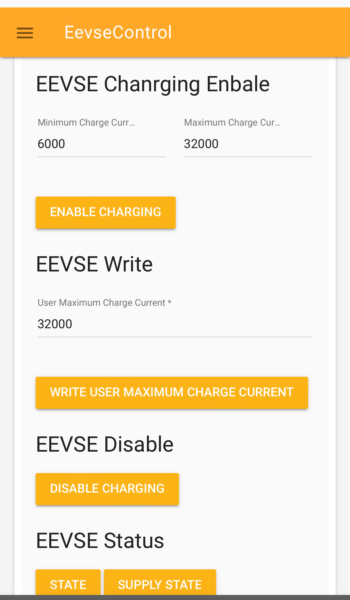

After the simulated charging demand event is triggered. Enter the value of minimum charge current and maximum charge current, and click the `ENABLE CHARGING` button to start charging by below commands.

```
$ chip-tool energyevse enable-charging null <minimum_charge_current> <maximum_charge_current> <node_id> <endpoint_id> --timedInteractionTimeoutMs 3000
```
In this command:
- _<minimum_charge_current\>_ is the minimum charge current(mA).
- _<maximum_charge_current\>_ is the maximum charge current(mA).
- _<node_id\>_ is the user-defined ID of the commissioned node.
- _<endpoint_id\>_ is the ID of the endpoint with energyevse cluster implemented.

### EEVSE Write

Enter the value of user maximum charge current and click the `WRITE USER MAXIMUM CHARGE CURRENT` button to set user-maximum-charge-current sttribute value by below commands.
```
chip-tool energyevse write <user_maximum_charge_current> <node_id> <endpoint_id>
```
In this command:
- _<user_maximum_charge_current>_ is the user-defined maximum charge current(mA).

### EEVSE Charging Disable

Click the `DISABLE CHARGING` button to disable charging value by below commands.
```
chip-tool energyevse disable <node_id> <endpoint_id> --timedInteractionTimeoutMs 3000
```

### EEVSE Status

Use the following buttons to read the status of the `energyevse` attribute in the `EEVSE Status` section. The page and results are shown below:

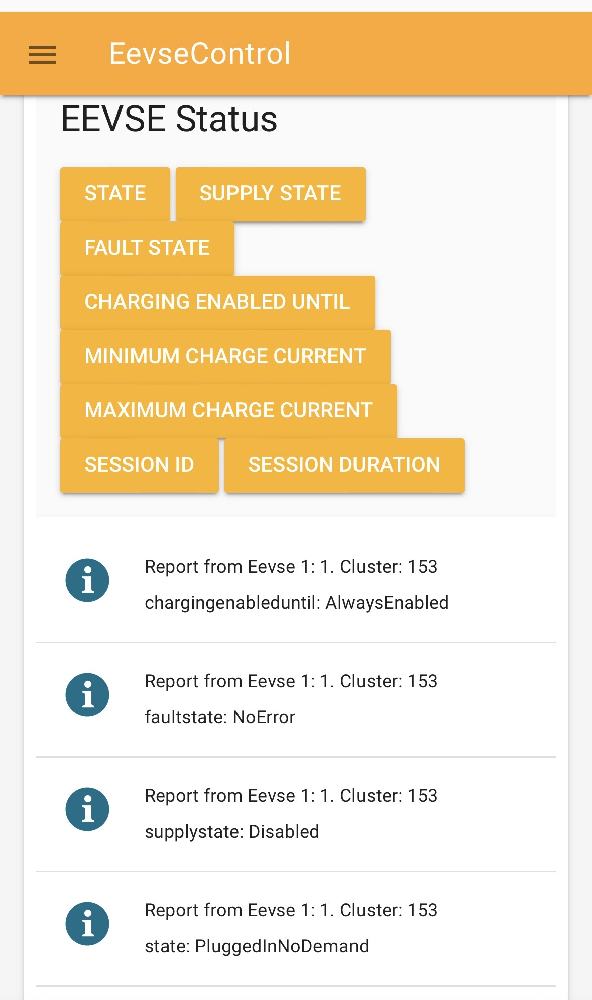

-   Use the `STATE` button to trigger the following command to read the state of energyevse:
    ```
    $ chip-tool energyevse read state <node_id> <endpoint_id>
    ```
-   Use the `SUPPLY STATE` button to trigger the following command to read the supply-state of energyevse:
    ```
    $ chip-tool energyevse read supply-state <node_id> <endpoint_id>
    ```
-   Use the `FAULT STATE` button to trigger the following command to read the fault-state of energyevse:
    ```
    $ chip-tool energyevse read fault-state <node_id> <endpoint_id>
    ```
-   Use the `CHARGING ENABLED UNTIL` button to trigger the following command to read the charging-enabled-until of tenergyevse:
    ```
    $ chip-tool energyevse read charging-enabled-until <node_id> <endpoint_id>
    ```
-   Use the `MINIMUM CHARGE CURRENT` button to trigger the following command to read the minimum-charge-current of energyevse:
    ```
    $ chip-tool energyevse read minimum-charge-current <node_id> <endpoint_id>
    ```
-   Use the `MAXIMUM CHARGE CURRENT` button to trigger the following command to read the maximum-charge-current of energyevse:
    ```
    $ chip-tool energyevse read maximum-charge-current <node_id> <endpoint_id>
    ```
-   Use the `SESSION ID` button to trigger the following command to read the session-id of energyevse:
    ```
    $ chip-tool energyevse read session-id <node_id> <endpoint_id>
    ```
-   Use the `SESSION DURATION` button to trigger the following command to read the session-duration of energyevse:
    ```
    $ chip-tool energyevse read session-duration <node_id> <endpoint_id>
    ```

#### Report Format

The EEVSE read report is output in text format with the following structure:
```
Report from ${nodealias} ${nodeid}:${endpoint}. Cluster:${cluster}
${attribute}:${value}
```
In the structure above,

- ${nodealias}: The node alias of the device.
- ${nodeid}: The nodeid of the device.
- ${endpoint}: The endpoint of the device.
- ${cluster}: The cluster name to which the device belongs.
- ${attribute}: The name of the attribute being reported. In this case, the default attributes are `state`, `supplystate`, `faultstate`, `chargingenableduntil`, `minimumchargecurrent`, `maximumchargecurrent`, `sessionid`, `sessionduration`.
- ${value}: The value of the attribute.

<a name="note"></a>

## Additional Notes

- Deleting the `/tmp/chip_tool_config.ini` file and any other `.ini` files in the `/tmp` directory may help to resolve problems caused by outdated configuration.
Running `rm -rf /tmp/chip_*` will remove these files. This will allow the chip-tool-web to rebuild its configuration files from scratch.

- The timeout for all buttons in the chip-tool-web that execute commands is set to 60 seconds. During the command execution process, the interface will display the command execution waiting effect. Please wait patiently for the command to finish executing and return a result of `success` or `failed`.

- In general, commands related to `Pairing` may take longer to execute, while commands related to `OnOff` functionality will execute faster. If a pairing command takes a long time to execute and returns with `failed`, please check that the device configuration follows the [documentation](./nxp_mpu_matter_demos.md). Also, try pairing again after running `rm -rf /tmp/chip_*`.

- The chip-tool-web supports commissioning multiple devices at the same time. However, in the current version, only one device can be connected at a time in each pairing mode. Therefore, the current version of chip-tool-web can pair and control three devices at the same time. Note that you should not run `rm -rf /tmp/chip_*` while commissioning multiple devices at once, as this will erase the useful information of the successfully paired devices.

- New features are still being developed and expanded.