# Running Matter Commissioning in Home Assistant application based on i.MX MPU platforms

The [Home Assistant](https://www.home-assistant.io/) (HA) application runs on both Android and IOS systems. By deploying the Home Assistant and Matter Server Docker on the i.MX MPU platform, you can use the HA application on the phone to manage Matter devices intuitively and easily. This document shows how to deploy the Home Assistant and Matter Server Docker on i.MX MPU platforms and then shows how to commission with i.MX Matter devices in the HA application.

 [**Overview**](#overview)

 [**Deploying the Docker on the i.MX MPU platform**](#deply-docker)

 [**Running the Home Assistant application on the Phone**](#running-app)

 [**Commissioning the i.MX Matter device using the Phone app commissioner**](#commissioning-with-phone)

 [**Commissioning the i.MX Matter device using the i.MX commissioner**](#commissioning-with-imx)

## Overview

The i.MX MPU platforms support both the Phone App commissioner and the i.MX commissioner for HA application. As shown in the figure below, by deploying dockers on an i.MX device, the i.MX device becomes the HA server, and the HA application can access the HA server via URL. You can then perform the phone app commissioning and the i.MX commissioning on the HA application.

 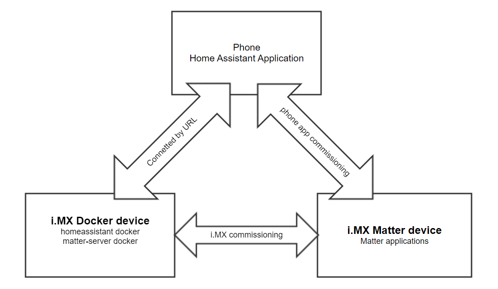

Figure HA schematic diagram for i.MX MPU platform

## Deploying the Docker on the i.MX MPU platform

You should first download and deploy the Dockers on an i.MX MPU platform. This is done in the following 3 steps.

Step 1. Create a new partition to store the Docker images.

The docker images take up about 3G of space. If there is not enough space left in existing partitions, you can use the following process to create a new partition. The following process uses the iMX 93 EVK as an example. In this case, the iMX 93 image is flashed to a 16G SD card.

        root@imx93evk-iwxxx-matter:~# fdisk /dev/mmcblk1

        Welcome to fdisk (util-linux 2.39.3).
        Changes will remain in memory only, until you decide to write them.
        Be careful before using the write command.

        This disk is currently in use - repartitioning is probably a bad idea.
        It's recommended to umount all file systems, and swapoff all swap
        partitions on this disk.

        Command (m for help): p

        Disk /dev/mmcblk1: 14.84 GiB, 15931539456 bytes, 31116288 sectors
        Units: sectors of 1 * 512 = 512 bytes
        Sector size (logical/physical): 512 bytes / 512 bytes
        I/O size (minimum/optimal): 512 bytes / 512 bytes
        Disklabel type: dos
        Disk identifier: 0x076c4a2a

        Device         Boot  Start      End  Sectors  Size Id Type
        /dev/mmcblk1p1 *     16384   186775   170392 83.2M  c W95 FAT32 (LBA)
        /dev/mmcblk1p2      196608 10500239 10303632  4.9G 83 Linux

        Command (m for help): n

        Partition type
        p   primary (2 primary, 0 extended, 2 free)
        e   extended (container for logical partitions)
        Select (default p): p
        Partition number (3,4, default 3): 3
        First sector (2048-31116287, default 2048): 10500240
        Last sector, +/-sectors or +/-size{K,M,G,T,P} (10500240-31116287, default 31116287): 31116287

        Created a new partition 3 of type 'Linux' and of size 9.8 GiB.

        Command (m for help): w
        The partition table has been altered.
        Syncing disks.

    root@imx93evk-iwxxx-matter:~# mkfs.ext4 /dev/mmcblk1p3
        mke2fs 1.47.0 (5-Feb-2023)
        Discarding device blocks: done
        Creating filesystem with 2577006 4k blocks and 644640 inodes
        Filesystem UUID: d3e14ca0-1d1c-43c0-a645-7cce0849d7b8
        Superblock backups stored on blocks:
                32768, 98304, 163840, 229376, 294912, 819200, 884736, 1605632

        Allocating group tables: done
        Writing inode tables: done
        Creating journal (16384 blocks): done
        Writing superblocks and filesystem accounting information: done

Step 2. Mount the new partition to the "~/image" folder and restart the docker service using the commands below.

    root@imx93evk-iwxxx-matter:~# mkdir image
    root@imx93evk-iwxxx-matter:~# mount /dev/mmcblk1p3 image
    root@imx93evk-iwxxx-matter:~# mkdir ~/image/docker
    root@imx93evk-iwxxx-matter:~# systemctl stop docker
    root@imx93evk-iwxxx-matter:~# cd /var/lib/
    root@imx93evk-iwxxx-matter:/var/lib# mv docker docker_old
    root@imx93evk-iwxxx-matter:/var/lib# ln -s ~/image/docker/ ./
    root@imx93evk-iwxxx-matter:/var/lib# systemctl start docker

Step 3. Download and deploy the homeassistant and matter-server docker images.

    $ docker run -d --name homeassistant --privileged --restart=unless-stopped -e TZ=MY_TIME_ZONE -v /PATH_TO_YOUR_CONFIG:/config -v /run/dbus:/run/dbus:ro --network=host ghcr.io/home-assistant/home-assistant:2024.9.0.dev202408250224
    $ docker run -d --name matter-server --restart=unless-stopped --security-opt apparmor=unconfined -v $(pwd)/data:/data --network=host ghcr.io/home-assistant-libs/python-matter-server:stable

It will take a few minutes to download and deploy the images. You can check the dockers by running "$ docker image" after deploying the dockers.

    $ docker images
    REPOSITORY                                         TAG                        IMAGE ID       CREATED       SIZE
    ghcr.io/home-assistant-libs/python-matter-server   stable                     411e6e62bc54   4 days ago    488MB
    ghcr.io/home-assistant/home-assistant              2024.9.0.dev202408250224   3ec513894eab   5 weeks ago   1.76GB

## Running the Home Assistant application on the Phone

Before running the HA application, you need to do some environmental configuration.
First, you can use the commands below to connect to the Wi-Fi AP on the i.MX docker device. And check the IP address.

    $ wpa_passphrase ${SSID} ${PASSWORD} > wifiap.conf

    $ ifconfig eth0 down
    $ modprobe moal mod_para=nxp/wifi_mod_para.conf
    $ wpa_supplicant -d -B -i mlan0 -c ./wifiap.conf
    $ sleep 5
    $ modprobe btnxpuart
    $ hciconfig hci0 up

    $ ifconfig mlan0       # check IP address

Then, connect to the same Wi-Fi AP, open BT on your phone, and open the HA app on you phone and configure the HA server URL.

If you are a new user of this application, you can set the URL when you log in to this application. Enter the URL and click the "Connect" button. The IP address of URL is the i.MX docker device IP address and port is 8123.

 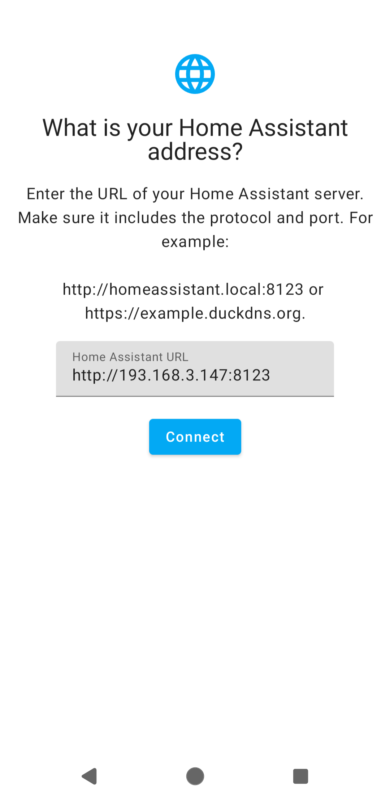

Figure Configuring the Home Assistant server URL when logging in

Or you can configure the URL in the settings according to the below steps, click the "SETTINGS", "Home", "Home Assitant URL" buttons in sequence on the following page to update the URL.

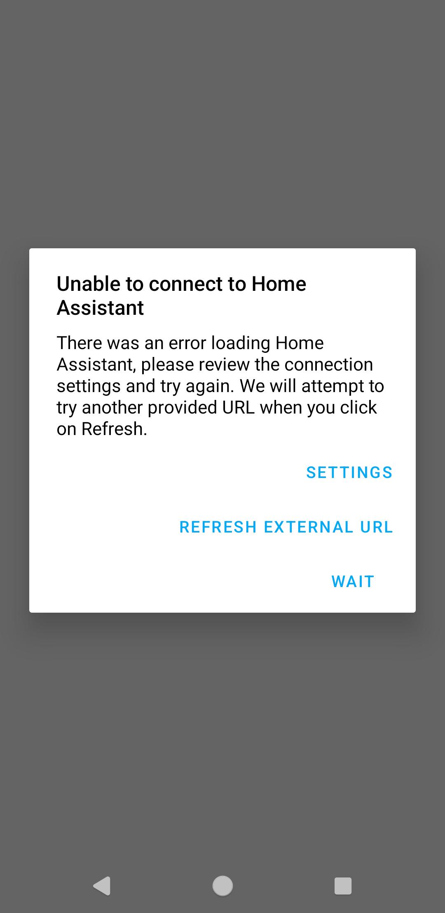 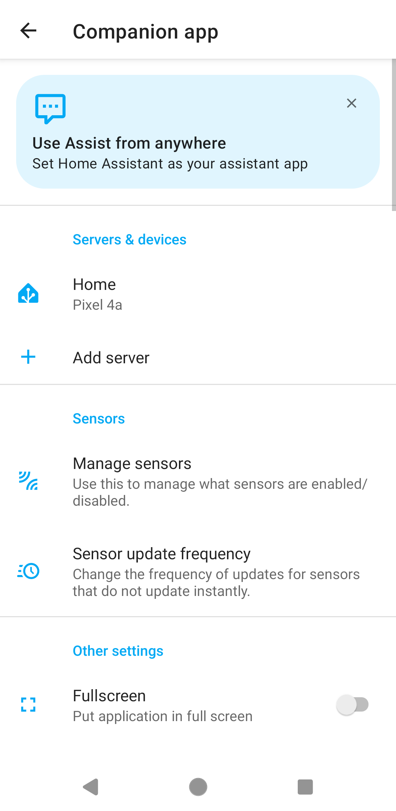 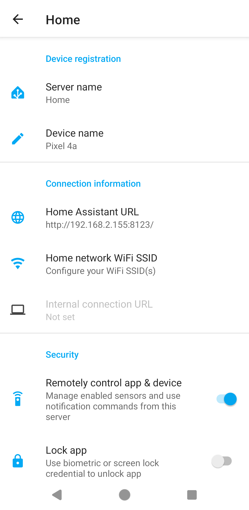

Figure Configuring the Home Assistant server URL in Settings

After configuring the correct URL, you can use this application normally.

## Commissioning the i.MX Matter device using the Phone app commissioner

This chapter shows how to commission an i.MX Matter device using the phone app commissioner.

First, set up the i.MX Matter device. There are two ways to run the Matter application. Take the chip-lighting-app as an example.

Option 1

    $ wpa_passphrase ${SSID} ${PASSWORD} > wifiap.conf
    $ modprobe moal mod_para=nxp/wifi_mod_para.conf
    $ wpa_supplicant -d -B -i mlan0 -c ./wifiap.conf
    $ sleep 5
    $ chip-lighting-app

Option 2

    $ modprobe moal mod_para=nxp/wifi_mod_para.conf
    $ modprobe btnxpuart
    $ hciconfig hci0 up
    $ chip-lighting-app --wifi --ble-device 0

After running chip-lighting-app running, you will find a line log like below, copy the URL and open it in a browser, you can see the QR code of this Matter application.

    CHIP:SVR: https://project-chip.github.io/connectedhomeip/qrcode.html?data=MT%3A-24J042C00KA0648G00

Then, you can commission i.MX Matter application as shown in the following pictures. Click the "Settings", "Devices & services", "+ ADD INTEGRATION", "Add Matter device", "No, it's new.", "Open camera here" buttons in sequence on the following pages to start scanning the QR code of the i.MX Matter application.

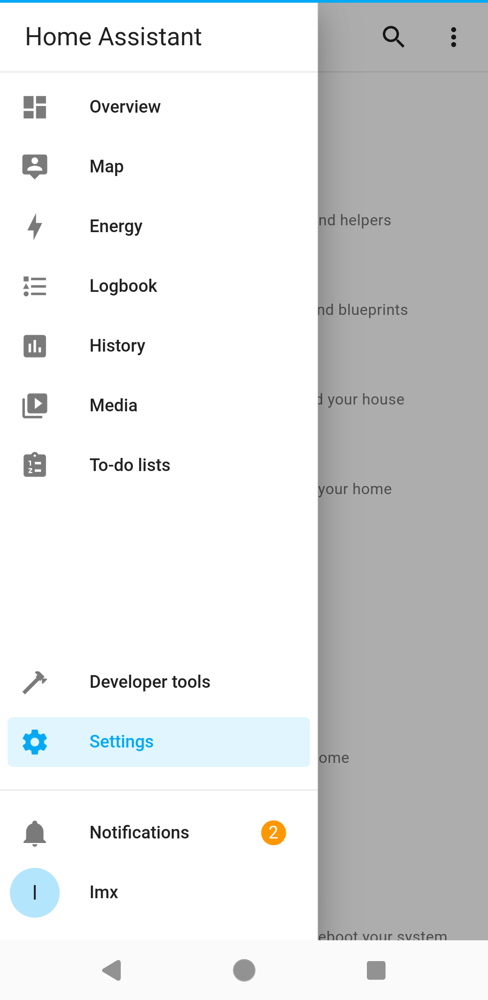 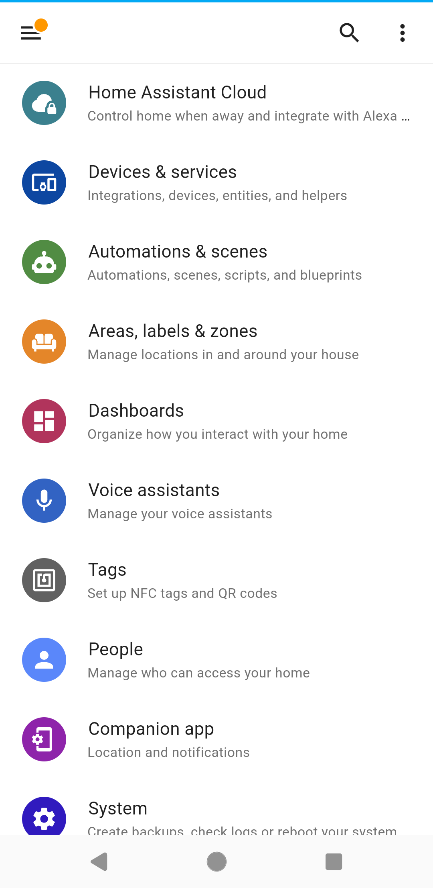 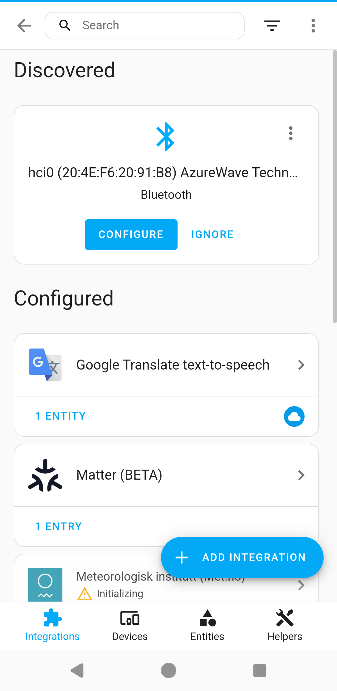 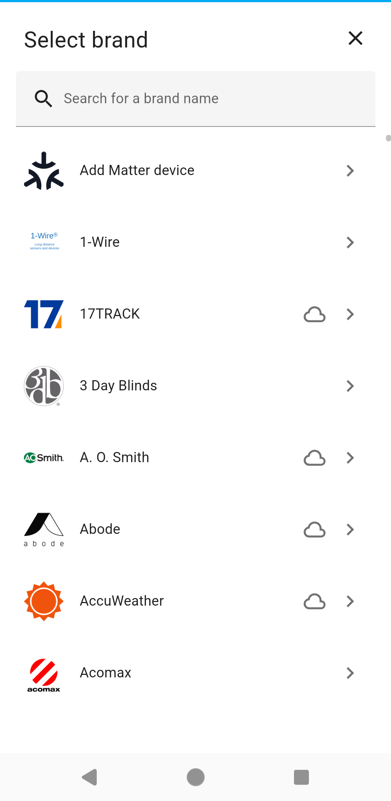 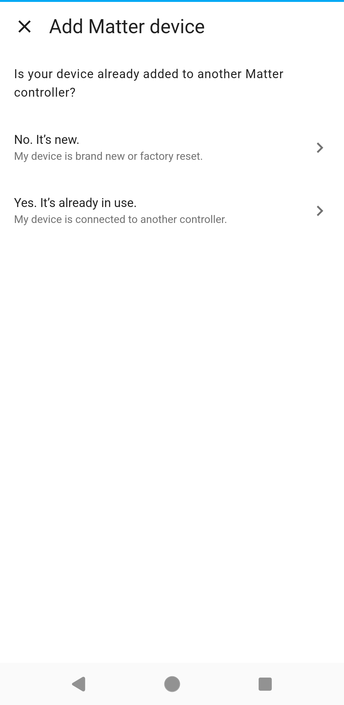 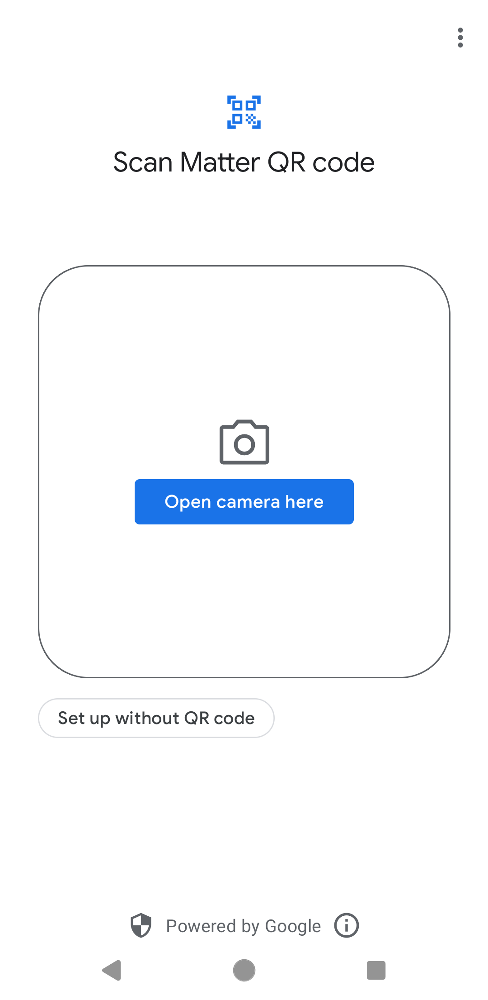

Figures How to start the commissioning on the phone app

Once the the QR code is scanned, it goes through the following processes to connect to the i.MX Matter application chip-lighting-app.

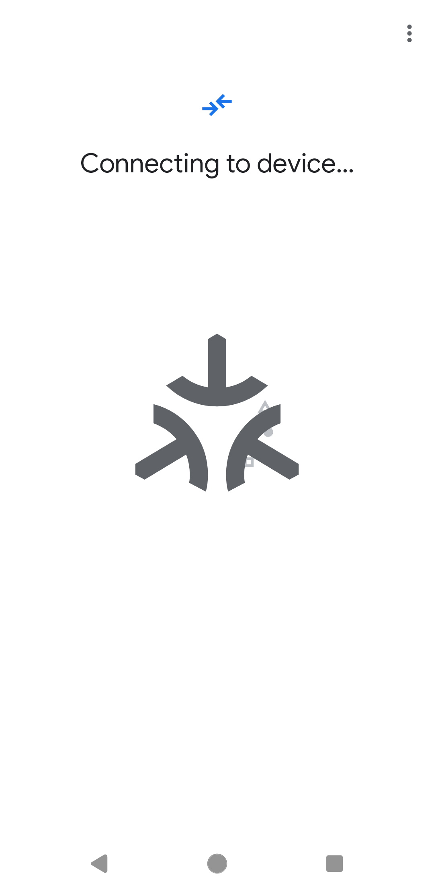  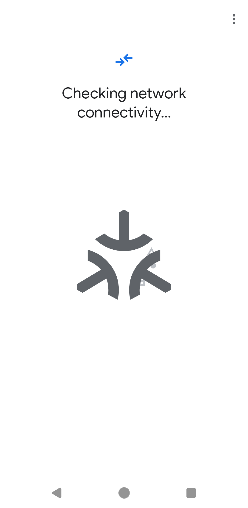 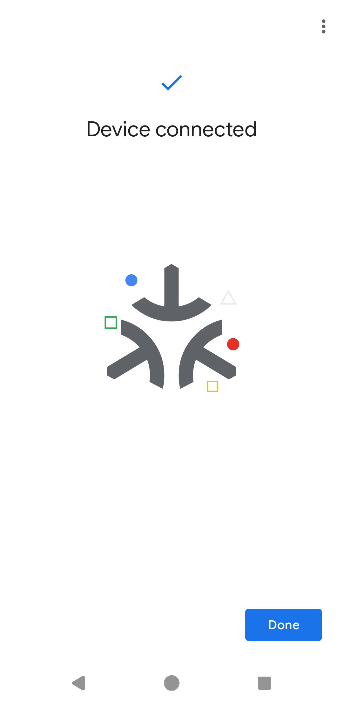

Figures Device connection procedure

Once the device has been successfully connected, you will be able to control it.

## Commissioning the i.MX Matter device using the i.MX commissioner

This chapter shows how to commission an i.MX Matter device using the i.MX commissioner in the HA application.

First, set up the i.MX Matter device, take the chip-lighting-app as an example.

    $ wpa_passphrase ${SSID} ${PASSWORD} > wifiap.conf
    $ modprobe moal mod_para=nxp/wifi_mod_para.conf
    $ wpa_supplicant -d -B -i mlan0 -c ./wifiap.conf
    $ sleep 5
    $ chip-lighting-app

Then, set the Matter URL in the HA apllication, Click the "Settings", "Matter(BETA) CONFIGURE", "SUBMIT"(set the Matter URL as "ws://localhost:5580/ws") buttons on the following pages in order. After setting the Matter URL, the page will look like the last figure below.

**Note:** If the HA app has commissioned a Matter device, the Matter URL has been configured by default, no need take this step.

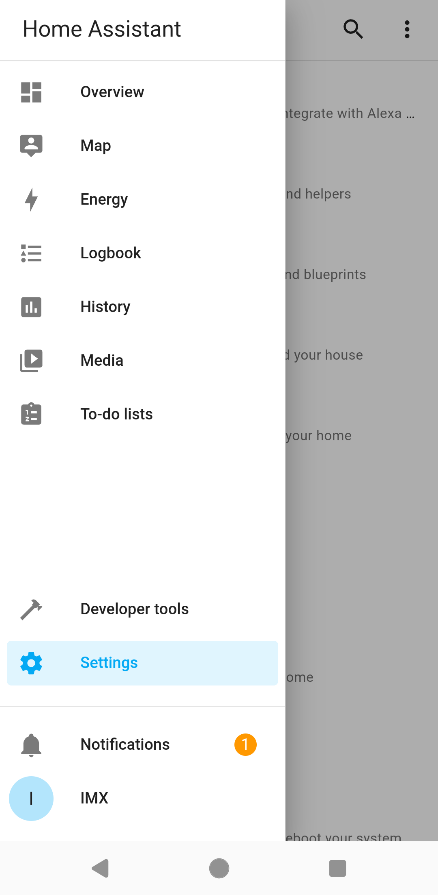 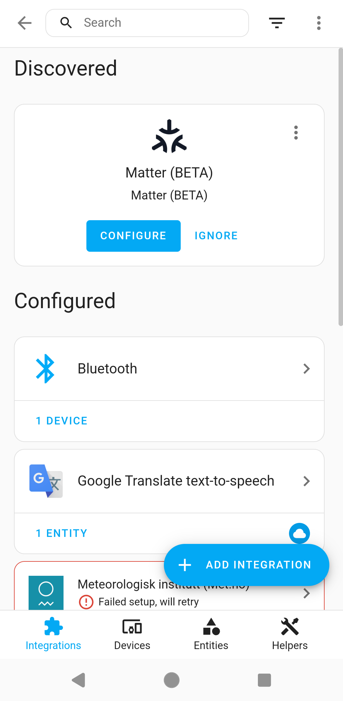 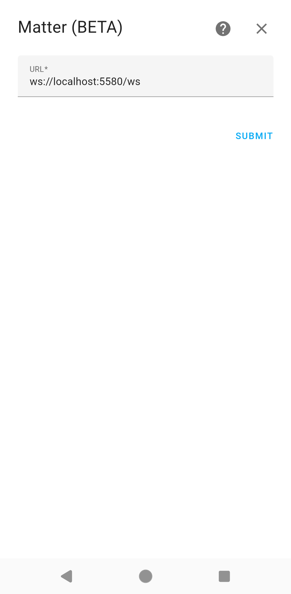 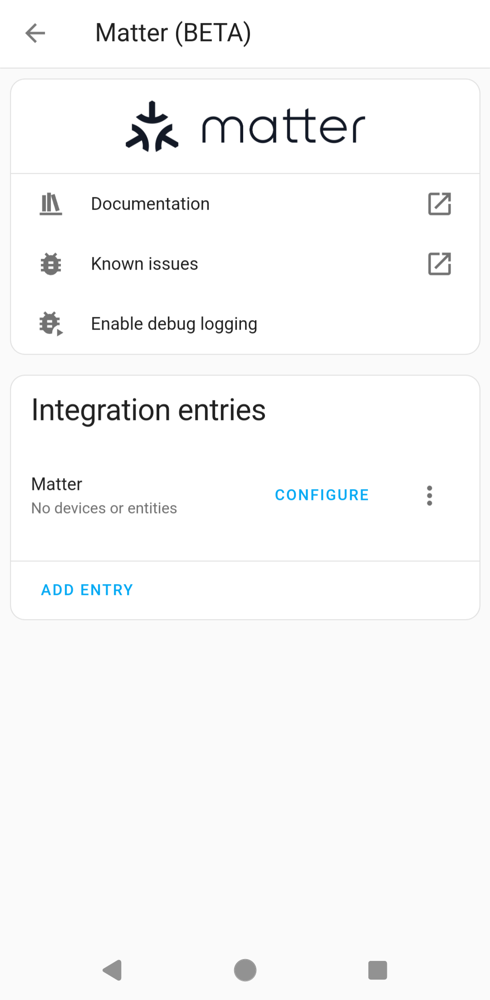

Figures Configure Matter URL

Finally, click the "CONFIGURE" button on the Matter (BETA) page to perform the i.MX commissioning, you need to click the "COMMISSION DEVICE" button in the following first page, enter the code and then click the "COMMISSION" button, the commissioning process will go through [commissioning process](#commissioning-process)

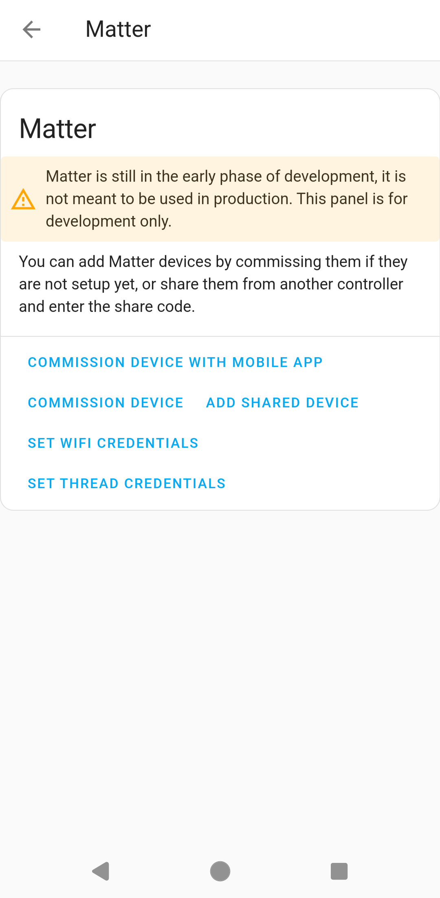 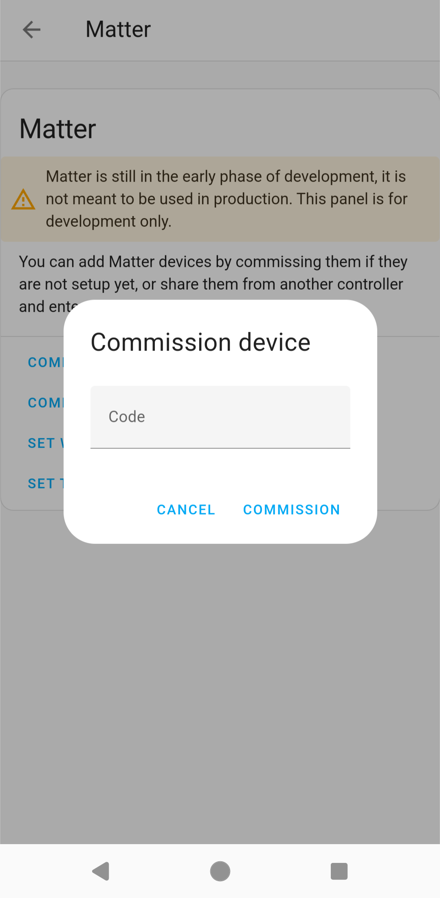 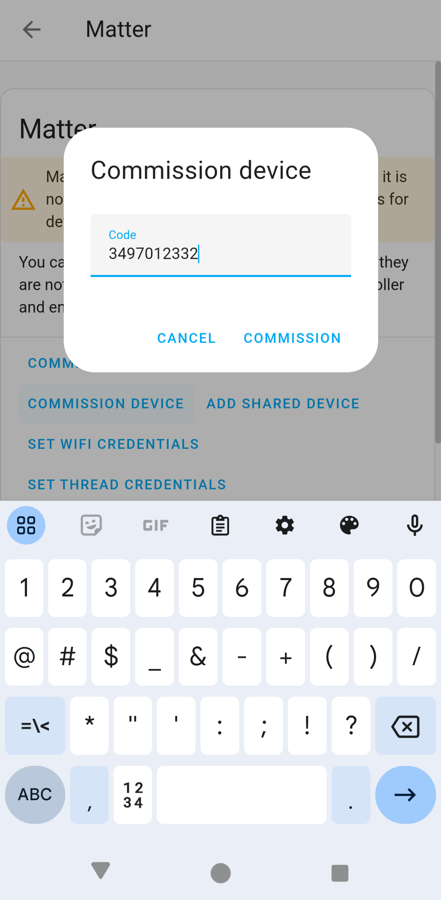

Figures the i.MX commissioning

After connectting the i.MX Matter device, you can check the Matter device information and control the device in the page below.

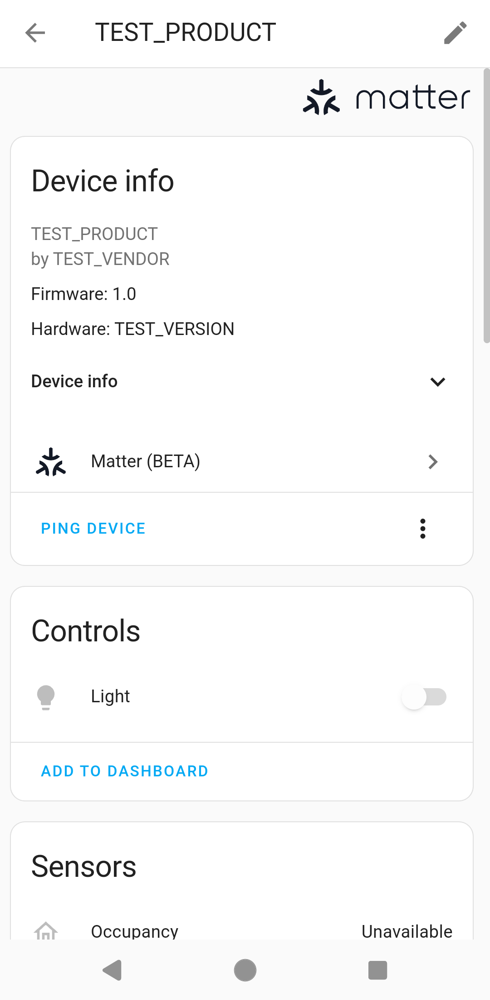

Figure Device information and controls page

## FAQ

### What should do if the download fails or the download speed of the Docker image is very slow?

The download failure or slow download speed may be caused by network issues. Please use the following commands to set the proxies for the Docker service. Then retry to download and deploy the Docker image again.

    $ mkdir /etc/systemd/system/docker.service.d
    $ vi /etc/systemd/system/docker.service.d/http-proxy.conf
        [Service]
        Environment="HTTP_PROXY=${YOUR_HTTP_PROXY_URL}:${YOUR_HTTP_PROXY_PORT}"
        Environment="HTTPS_PROXY=${YOUR_HTTPS_PROXY_URL}:${YOUR_HTTPS_PROXY_PORT}"
        Environment="NO_PROXY=localhost,127.0.0.*,${YOUR_HOST_network_prefix}.*"

    $ systemctl daemon-reload
    $ systemctl restart docker
