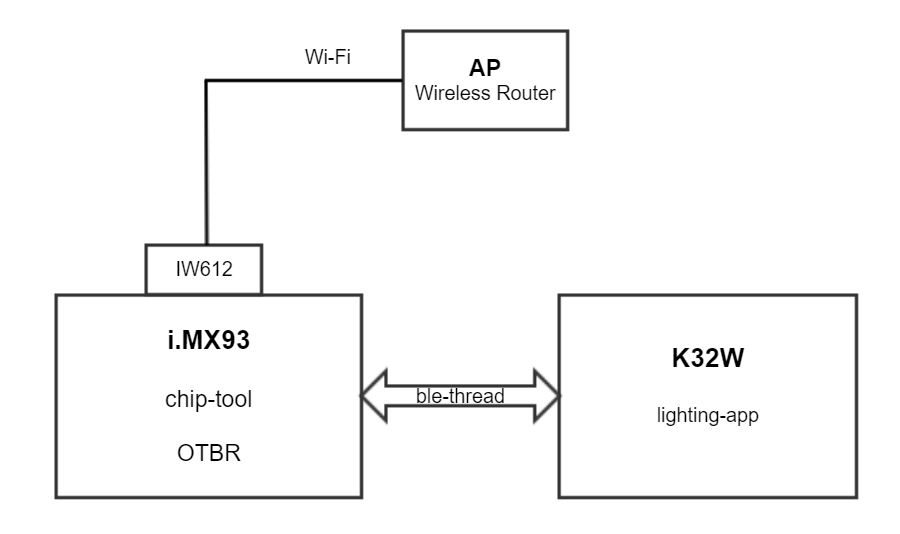
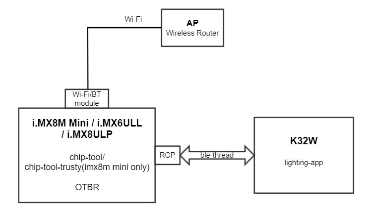
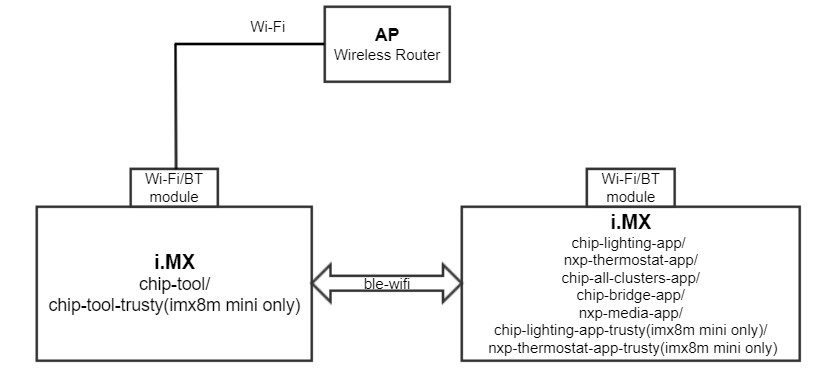

# Running Matter demos on i.MX MPU platforms

This document describes how to use the Matter demos on the i.MX MPU platforms. It shows how to run Matter demos with OTBR on the i.MX MPU platform and how to commission with the K32W DK6 lighting application, then it shows how to run i.MX Matter demos for ble-wifi and onnetwork commissioning.

 [**Hardware requirements**](#hardware-requirements)

 [**Software requirements**](#software-requirements)

 [**Running Matter demos with OTBR and OpenThread on the i.MX MPU platform**](#matter-demos-with-otbr)

 [**Running other Matter demos on the i.MX MPU platform**](#other-matter-demos)

 [**FAQ**](#note-of-using-matter-demos)

## Hardware requirements

- i.MX93 EVK + IW612(WiFi-BT-Thread tri-radio chipset)  → Role: Matter controller or Matter end device

- i.MX8M Mini EVK + 88W8987(WiFi-BT combo module)  → Role: Matter controller or Matter end device

- i.MX6ULL EVK + 88W8987(WiFi-BT combo module)  → Role: Matter controller or Matter end device

- i.MX8ULP EVK + IW416(WiFi-BT combo module)  → Role: Matter controller or Matter end device

   For more information on the details of the i.MX MPU Matter platforms, please visit [NXP MPU Matter platform](https://www.nxp.com/design/development-boards/i-mx-evaluation-and-development-boards/mpu-linux-hosted-matter-development-platform:MPU-LINUX-MATTER-DEV-PLATFORM).

- K32W RCP → Role: OpenThread RCP module

   A K32W061 dongle is required to run the [OpenThread Radio Co-Processor](https://openthread.io/platforms/co-processor) firmware.

- K32W DK6 main board with K32W061 daughter board → Role: Matter Thread lighting-app device

    More information about the details of the K32W DK6 main board with K32W061 daughter board can be found at [NXP Matter Thread Platform](https://www.nxp.com/products/wireless/multiprotocol-mcus/end-node-matter-with-thread-development-platform:END-NODE-MATTER-THREAD).

- Linux host computer

- Wi-Fi access point supporting IPv6 and IPv6 DHCP service

## Software requirements

- You can refer to the [Yocto images and demos build guide](../../README.md) to build Yocto images and demos for i.MX Matter devices.
- You can refer to [K32W lighting example application guide](https://github.com/project-chip/connectedhomeip/tree/master/examples/lighting-app/nxp/k32w/k32w0/README.md) to build the K32W DK6 firmware and lighting-app firmware and set up the K32W lighting example application.

## Running Matter demos with OTBR and OpenThread on the i.MX MPU platform

For devices that support the Thread protocol, this guide uses the NXP K32W DK6 main board with K32W061 daughter board running lighting application as an example. The i.MX MPU platform can perform Matter networking with end devices using OTBR. Matter with OTBR on i.MX devices network topology diagram as shown below.

 

Figure Matter with OTBR network topology diagram for i.MX93 EVK

 

Figure Matter with OTBR network topology diagram for i.MX8M Mini EVK or i.MX6ULL EVK

The commissioning process consists of the following main stages:

- Setup OTBR on i.MX MPU platform
- Configure OpenThread Network
- Factory reset lighting application on K32W DK6
- Commission the lighting-app on the i.MX controller
- Control the lighting-app on the i.MX controller

### Setup OTBR on i.MX MPU platform

To set up OTBR on the i.MX MPU platform, you need to do three steps:

step1. Save the Wi-Fi SSID and password to a file.

    $ wpa_passphrase ${SSID} ${PASSWORD} > wifiap.conf

Step2. Connecting to the Wi-Fi AP, Enabling BT, and Setting Up OTBR on the i.MX MPU Platform.

#### For i.MX93 EVK + IW612 platform:

        、、、
        ifconfig eth0 down
        modprobe moal mod_para=nxp/wifi_mod_para.conf
        wpa_supplicant -d -B -i mlan0 -c ./wifiap.conf
        sleep 5
        udhcpc -i mlan0
        modprobe btnxpuart
        hciconfig hci0 up
        sleep 1
        echo 1 > /proc/sys/net/ipv6/conf/all/forwarding
        echo 1 > /proc/sys/net/ipv4/ip_forward
        echo 2 > /proc/sys/net/ipv6/conf/all/accept_ra
        ln -sf /usr/sbin/xtables-nft-multi /usr/sbin/ip6tables
        ipset create -exist otbr-ingress-deny-src hash:net family inet6
        ipset create -exist otbr-ingress-deny-src-swap hash:net family inet6
        ipset create -exist otbr-ingress-allow-dst hash:net family inet6
        ipset create -exist otbr-ingress-allow-dst-swap hash:net family inet6
        sleep 1

        otbr-agent-iwxxx-spi -I wpan0 -B mlan0 'spinel+spi:///dev/spidev0.0?gpio-reset-device=/dev/gpiochip4&gpio-int-device=/dev/gpiochip5&gpio-int-line=10&gpio-reset-line=1&spi-mode=0&spi-speed=1000000&spi-reset-delay=0' &
        #These two lines are one command

        sleep 2
        iptables -A FORWARD -i mlan0 -o wpan0 -j ACCEPT
        iptables -A FORWARD -i wpan0 -o mlan0 -j ACCEPT
        otbr-web &
        、、、

#### For i.MX8M Mini EVK + 88W8987 + K32W platform or i.MX8ULP EVK + IW416 + K32W platform:

        、、、
        ifconfig eth0 down
        modprobe moal mod_para=nxp/wifi_mod_para.conf
        wpa_supplicant -d -B -i mlan0 -c ./wifiap.conf
        sleep 5
        udhcpc -i mlan0
        modprobe btnxpuart
        hciconfig hci0 up
        echo 1 > /proc/sys/net/ipv6/conf/all/forwarding
        echo 1 > /proc/sys/net/ipv4/ip_forward
        echo 2 > /proc/sys/net/ipv6/conf/all/accept_ra
        ln -sf /usr/sbin/xtables-nft-multi /usr/sbin/ip6tables
        ipset create -exist otbr-ingress-deny-src hash:net family inet6
        ipset create -exist otbr-ingress-deny-src-swap hash:net family inet6
        ipset create -exist otbr-ingress-allow-dst hash:net family inet6
        ipset create -exist otbr-ingress-allow-dst-swap hash:net family inet6
        sleep 1
        otbr-agent -I wpan0 -B mlan0  'spinel+hdlc+uart:///dev/ttyUSB0?uart-baudrate=1000000' -v -d 5 &
        sleep 2
        iptables -A FORWARD -i mlan0 -o wpan0 -j ACCEPT
        iptables -A FORWARD -i wpan0 -o mlan0 -j ACCEPT
        otbr-web &
        、、、

#### For i.MX6ULL EVK + 88W8987 + K32W platform:

For i.MX6ULL, it is mandatory to change fdt_file to setup WiFi and BT. You must enter uboot mode and run follow commands, then reboot the board.

    => print fdt_file
    fdt_file=undefined
    => fatls mmc 1
        46172   imx6ull-14x14-evk-btwifi.dtb
        45444   imx6ull-14x14-evk-emmc.dtb
        45998   imx6ull-14x14-evk-gpmi-weim.dtb
        47157   imx6ull-14x14-evk-reve-btwifi.dtb
        46429   imx6ull-14x14-evk-reve-emmc.dtb
        46983   imx6ull-14x14-evk-reve-gpmi-weim.dtb
        46369   imx6ull-14x14-evk-reve.dtb
        45384   imx6ull-14x14-evk.dtb
       400072   tee.bin
       400136   uTee-6ullevk
      9187488   zImage

    11 file(s), 0 dir(s)

    => fdt_file=imx6ull-14x14-evk-btwifi.dtb
    => saveenv
    Saving Environment to MMC... Writing to MMC(1)... OK

    #make sure fdt_file have been changed
    => print fdt_file
    fdt_file=imx6ull-14x14-evk-btwifi.dtb

The i.MX6ULL OTBR setup commands are same with the i.MX8M Mini commands.

*Note: If "$ ifconfig wpan0" can find the wpan0 as shown below, the otbr-agent was successfully set up.*

    $ ifconfig wpan0
    wpan0: flags=4240<POINTOPOINT,NOARP,MULTICAST>  mtu 1280
    unspec 00-00-00-00-00-00-00-00-00-00-00-00-00-00-00-00  txqueuelen 500  (UNSPEC)
    RX packets 0  bytes 0 (0.0 B)
    RX errors 0  dropped 2  overruns 0  frame 0
    TX packets 0  bytes 0 (0.0 B)
    TX errors 0  dropped 0 overruns 0  carrier 0  collisions 0

### Configure OpenThread Network

You can form the Openthread network manually by following steps:

    $ ot-ctl dataset init new
    $ ot-ctl dataset commit active
    $ ot-ctl ifconfig up
    $ ot-ctl thread start

Then, you should get thread network credentials information.

    $ ot-ctl dataset active -x
    # Then you will get a dataset like "0e080000000000010000000300001035060004001fffe00208d625374d9c65c2a30708fd57eb72a74fa52505108a177ca3b66becf3bbe2149eb3d135c8030f4f70656e5468726561642d656338350102ec85041044ac05395e78940b72c1df1e6ad02a120c0402a0f7f8"

***Note: please use the ot-ctl-iwxxx-spi instead of ot-ctl on i.MX93 device.***

### Setup ot-daemon on i.MX MPU platform

Please use below commands to setup ot-daemon:

    #For i.MX8M Mini EVK + 88W8987, i.MX8ULP EVK and i.MX6ULL EVK + 88W8987 with K32W RCP platform:

    $ ot-daemon 'spinel+hdlc+uart:///dev/ttyUSB0?uart-baudrate=1000000' &

    #For i.MX93 EVK platform:

    $ modprobe moal mod_para=nxp/wifi_mod_para.conf
    $ ot-daemon-iwxxx-spi 'spinel+spi:///dev/spidev0.0?gpio-reset-device=/dev/gpiochip4&gpio-int-device=/dev/gpiochip5&gpio-int-line=10&gpio-reset-line=1&spi-mode=0&spi-speed=1000000&spi-reset-delay=0' &

You can form the Openthread network manually by following steps:

    $ ot-client-ctl dataset init new
    $ ot-client-ctl dataset commit active
    $ ot-client-ctl ifconfig up
    $ ot-client-ctl thread start

***Note: please use the ot-client-iwxxx-spi instead of ot-client-ctl on i.MX93 device.***

### Factory reset lighting application on K32W DK6

Step1. Press the SW2 button on OM15802, after 6 seconds, the device will reset its persistent configuration and initiate a reboot.

Step2. Toggle reset.

Step3. Press the USERINTERFACE button to start the BLE Advertising, which is mandatory for device commissioning.

### Commission the lighting-app on the i.MX controller

Commissioning command as below.

    # ble-thread pairing
    $ chip-tool pairing ble-thread 8888 hex:0e080000000000010000000300001035060004001fffe00208d625374d9c65c2a30708fd57eb72a74fa52505108a177ca3b66becf3bbe2149eb3d135c8030f4f70656e5468726561642d656338350102ec85041044ac05395e78940b72c1df1e6ad02a120c0402a0f7f8 20202021 3840

The parameter after "ble-thread" is node-id (here it is 8888, it can be any positive integer starting from 1) that should be set uniquely for each Matter device that joined the network, the last but one parameter is pin code (here it is fixed to 20202021), the last parameter is discriminator (here it is fixed to 3840).

If there is a message **“Device commissioning completed with success”** in the controller log, it means that the Matter device has successfully joined the network.

### Control the lighting-app on the i.MX controller

    # toggle the lighting
    $ chip-tool onoff toggle 8888 1
    # turn on the lighting
    $ chip-tool onoff on 8888 1
    # turn off the lighting
    $ chip-tool onoff off 8888 1

    # read the lighting on-off status
    $ chip-tool onoff read on-off 8888 1

Since chip-tool-trusty can run on the i.MX8M Mini EVK platform, the chip-tool in the above commands can replace chip-tool-trusty. **Note that before running chip-tool-trusty, you should use to the [enable command](#enable-the-secure-storage-service) to enable the secure storage service.**

## Running other Matter demos on i.MX MPU platform

For example applications running on the i.MX MPU platform, you can test the applications using two commissioning methods. These two commissioning methods require the i.MX platform running the chip tool as the controller device and another i.MX platform as the end device.

### Run example applications with ble-wifi commissioning method

The network topology diagram by using ble-wifi commissioning is shown below.

 

Figure i.MX network topology diagram for ble-wifi commissioning

The ble-wifi commissioning method requires the controller device needs to setup BT and connect to a Wi-Fi AP, the end device needs to setup BT.

The commissioning process consists of the following main stages:

- Set up BLE and connect to a Wi-Fi AP on the controller device
- Load the Wi-Fi/BT firmware and set up BLE on the end device
- Run the example application on the end device
- Commision and control the end devices on the controller device

#### Set up BT and connect to a wifi AP on controller device

step1. Save Wi-Fi SSID and Password to a file.

    $ wpa_passphrase ${SSID} ${PASSWORD} > wifiap.conf

step2. Setup BT and connectd to a WiFi AP.

For i.MX93 EVK, i.MX8M Mini EVK and i.MX6ULL EVK:

        、、、
        modprobe moal mod_para=nxp/wifi_mod_para.conf
        wpa_supplicant -d -B -i mlan0 -c ./wifiap.conf
        sleep 5
        udhcpc -i mlan0
        modprobe btnxpuart
        hciconfig hci0 up
        、、、

#### Load the Wi-Fi/BT firmware and set up BT on the end device

Load the Wi-Fi/BT firmware and set up BT. For i.MX93 EVK, i.MX8M Mini EVK and i.MX6ULL EVK:

        、、、
        modprobe moal mod_para=nxp/wifi_mod_para.conf
        sleep 5
        modprobe btnxpuart
        hciconfig hci0 up
        resolvconf -d mlan0.udhcpc
        ifconfig mlan0 192.168.1.1
        、、、

#### Run the example application on the end device

After setting up the network on both side platforms, run the example application on the end device.

___[ELE](https://www.nxp.com/products/nxp-product-information/nxp-product-programs/edgelock-secure-enclave:EDGELOCK-SECURE-ENCLAVE) has been integrated into i.MX93 EVK since the i.MX Matter 2023 Q3 release, so when you run example applications such as chip-lighting-app, nxp-thermostat-app, etc. on i.MX93 EVK, you need to run "$ systemctl start nvm_daemon" to enable ELE (only need to run once after each power-up), and then run example applications.___

    # to run chip-lighting-app
    $ chip-lighting-app --wifi --ble-device 0

    # to run chip-all-clusters-app
    $ chip-all-clusters-app --wifi --ble-device 0

    # to run nxp-thermostat-app
    $ nxp-thermostat-app --wifi --ble-device 0

    # to run chip-bridge-app
    $ chip-bridge-app --wifi --ble-device 0

    # to run nxp-meida-app
    $ nxp-media-app --wifi --ble-device 0

    # to run chip-energy-management-app
    $ chip-energy-management-app --wifi --ble-device 0

#### Finally, commission and control the end devices on the controller device.

##### commission the end devices

    $ chip-tool pairing ble-wifi 8888 ${SSID} ${PASSWORD} 20202021 3840

##### control the chip-lighting-app / chip-all-clusters-app

    $ chip-tool onoff on 8888 1
    $ chip-tool onoff off 8888 1
    $ chip-tool onoff toggle 8888 1
    $ chip-tool onoff read on-off 8888 1

##### control the nxp-thermostat-app

    # read the local temperature from nxp-thermostat-app.
    $ chip-tool thermostat read local-temperature 8888 1
    # read the abs-max-heat-setpoint-limit form nxp-thermostat-app.
    $ chip-tool thermostat read abs-max-heat-setpoint-limit 8888 1
    # read the abs-min-heat-setpoint-limit form nxp-thermostat-app.
    $ chip-tool thermostat read abs-min-heat-setpoint-limit 8888 1
    # read the max-heat-setpoint-limit form nxp-thermostat-app.
    $ chip-tool thermostat read max-heat-setpoint-limit 8888 1
    # read the min-heat-setpoint-limit form nxp-thermostat-app.
    $ chip-tool thermostat read min-heat-setpoint-limit 8888 1
    # set max-heat-setpoint-limit=2800(28℃)，which should satisfy the equation "min-heat-setpoint-limit <= max-heat-setpoint-limit <= abs-max-heat-setpoint-limit".
    $ chip-tool thermostat write max-heat-setpoint-limit 2800 8888 1
    # set occupied-heating-setpoint=1800(18℃)，which should satisfy the equation "min-heat-setpoint-limit <= occupied-heating-setpoint <= max-heat-setpoint-limit".
    $ chip-tool thermostat write occupied-heating-setpoint 1800 8888 1
    # check if occupied-heating-setpoint is set to 1800.
    $ chip-tool thermostat read occupied-heating-setpoint 8888 1
    # set occupied-heating-setpoint += 20, which cannot be set bigger than the value of max-heat-setpoint-limit.
    $ chip-tool thermostat setpoint-raise-lower 0 20 8888 1
    # check if occupied-heating-setpoint equal to 2000.
    $ chip-tool thermostat read occupied-heating-setpoint 8888 1
    # set occupied-heating-setpoint -= 10, which cannot be set lower than the value of min-heat-setpoint-limit.
    $ chip-tool thermostat setpoint-raise-lower 0 -10 8888 1
    # check if occupied-heating-setpoint equal to 1900.
    $ chip-tool thermostat read occupied-heating-setpoint 8888 1

##### control the chip-bridge-app

    $ chip-tool actions read setup-url 8888 1          # read setup-url
    $ chip-tool actions read endpoint-lists 8888 1     # read endpoint-lists
    $ chip-tool actions read action-list 8888 1        # read action-list
    $ chip-tool actions instant-action 0x1001 8888 1   # the room 1 LED1 LED2 will be ON on the bridge end.

##### control the nxp-media-app
Before playing media, you need to put the __media__ in the `/home/root/media` folder and select the output audio cards.

    # list all audio outputs
    $ chip-tool audiooutput read output-list 8888 1

> CHIP:TOO:     [3]: {
    CHIP:TOO:       **Index: 2**
    CHIP:TOO:       OutputType: 5
    CHIP:TOO:       **Name: Audio Jack**
    CHIP:TOO:      }

    # select the index of the audio jack for audio output.
> $ chip-tool audiooutput select-output **2** 8888 1

Then you should launch the app, and when you don't need it, you can stop it.

    # launch the nxp-media-app
    $ chip-tool applicationlauncher launch-app 8888 1 --Application '{"catalogVendorID": 123, "applicationID": "exampleid"}'
    # stop the nxp-media-app
    $ chip-tool applicationlauncher stop-app 8888 1 --Application '{"catalogVendorID": 123, "applicationID": "exampleid"}'

Control and read status for nxp-meida-app:

    # play media
    $ chip-tool mediaplayback play 8888 1
    # stop media
    $ chip-tool mediaplayback stop 8888 1
    # pause media
    $ chip-tool mediaplayback pause 8888 1
    # start over play the current media
    $ chip-tool mediaplayback start-over 8888 1
    # play previous media
    $ chip-tool mediaplayback previous 8888 1
    # play next media
    $ chip-tool mediaplayback next 8888 1
    # rewind the playing media, then use the play command to paly media
    $ chip-tool mediaplayback rewind 8888 1
    # fast forward the playing media, the playback speed will be 1-2-4-8-10
    $ chip-tool mediaplayback fast-forward 8888 1
    # move the current playback position forward by 20 seconds
    $ chip-tool mediaplayback skip-forward 20000 8888 1
    # move the current playback position backwrd by 20 seconds
    $ chip-tool mediaplayback skip-backward 20000 8888 1
    # move the current playback position to the 20th second
    $ chip-tool mediaplayback seek  20000 8888 1
    # read the current state, 0 means play, 1 means pause, 2 means stop
    $ chip-tool mediaplayback read current-state 8888 1
    # the start time of the currently playing media, which is always 0
    $ chip-tool mediaplayback read start-time 8888 1
    # the total duration of currently playing media
    $ chip-tool mediaplayback read duration 8888 1
    # the current position of currently playing media
    $ chip-tool mediaplayback read sampled-position 8888 1
    # the playback speed of currently playing media
    $ chip-tool mediaplayback read playback-speed 8888 1

###### control the nxp-media-app

    # read the attributes' value of the cluster electricalenergymeasurement
    $ chip-tool electricalenergymeasurement read accuracy 8888 1
    $ chip-tool electricalenergymeasurement read cumulative-energy-imported 8888 1
    $ chip-tool electricalenergymeasurement read cumulative-energy-exported 8888 1
    $ chip-tool electricalenergymeasurement read periodic-energy-imported 8888 1
    $ chip-tool electricalenergymeasurement read periodic-energy-exported 8888 1
    $ chip-tool electricalenergymeasurement read cumulative-energy-reset 8888 1
    # read and set some attributes' value of the cluster energyevse
    $ chip-tool energyevse read state 8888 1
    $ chip-tool energyevse read minimum-charge-current 8888 1
    $ chip-tool energyevse read maximum-charge-current 8888 1
    $ chip-tool energyevse write user-maximum-charge-current 30000 8888 1
    $ chip-tool energyevse read user-maximum-charge-current 8888 1
    $ chip-tool energyevse write randomization-delay-window 600 8888 1
    $ chip-tool energyevse write approximate-evefficiency 3500 8888 1
    $ chip-tool energyevse read approximate-evefficiency 8888 1

Currently, applications with trusty are supported on the i.MX8M Mini EVK, such as chip-tool-trusty, chip-lighting-app-trusty, nxp-thermostat-app-trusty and nxp-media-app-trusty. Before running these trusty example applications, you must execute the following commands to enable the secure storage service (only need to execute once after initial boot), and the the following commissioning steps are consistent with the above.

    $ systemctl enable storageproxyd
    $ systemctl start storageproxyd

###  Run example applications with onnetwork commissioning method

To test onnetwork, two devices must connect to the same Wi-Fi AP or connect to the same local area network. Taking the case of connecting to the same Wi-Fi AP as an example, the network topology diagram is shown below.

Figure i.MX Network Topology Diagram for Onnetwork Commissioning

First, you must connect the i.MX device acting as the controller device to a Wi-Fi AP using the following commands.

    wpa_passphrase ${SSID} ${PASSWORD} > wifiap.conf

    modprobe moal mod_para=nxp/wifi_mod_para.conf
    wpa_supplicant -d -B -i mlan0 -c ./wifiap.conf
    udhcpc -i mlan0

Then, run example applications on another i.MX device that acts as the end device.

    # to run chip-lighting-app
    $ chip-lighting-app

    # to run chip-all-clusters-app
    $ chip-all-clusters-app

    # to run nxp-thermostat-app
    $ nxp-thermostat-app

    # to run chip-bridge-app
    $ chip-bridge-app

    # to run chip-energy-management-app
    $ chip-energy-management-app

Final, commission and control the end device on the controller device.

    # commission the end devices
    $ chip-tool pairing onnetwork 8888 20202021

    # control commands same as ble-wifi commissioning method

To run applications with trusty on the i.MX8M Mini EVK by onnetwork commissioning way, you should use to the [enable command](#enable-the-secure-storage-service) to enable the secure storage service.

## FAQ

### Why chip-tool failed to control cluster after reboot?

Why does chip-tool fail to control the cluster after a reboot? This is because the default storage location of chip-tool on the Yocto operating system is in the `/tmp` directory, which is a temporary file system (tempfs) that is reset during power cycles. This can result in the loss of pairing information between the controller and the cluster, which includes applications such as chip-lighting-app, nxp-thermostat-app, chip-bridge-app, and more. To preserve this pairing information, it is critical to store the information in a persistent location. The recommended solution is to set the `TMPDIR` environment variable to a persistent location, such as `/etc`, before using chip-tool. This simple step can help ensure that the pairing information is stored in a directory that persists after a reboot, allowing you to avoid having to re-pair your devices after a reboot. Here are the detailed steps to set the `TMPDIR` environment variable in `/etc`:

Step 1. Export the `TMPDIR` environment variable to a persistent location on the controller device before using the chip-tool. This will preserve the pairing information with the cluster after a reboot. For example, `/etc` is one of the option locations to store these configuration files:

    $ export TMPDIR=/etc/

Step 2. Run the cluster application on end device

    # open the cluster application on the end device
    $ nxp-thermostat-app

Step 3. Use the controller to pair and control the desired application on the cluster end device using any pairing mode (onnetwork/ble-wifi). For example, run the following command to pair with and control the NXP thermostat app:

    # pairing the cluster on the controller device
    $ chip-tool pairing onnetwork 8888 20202021
    # control the cluster on the controller device
    $ chip-tool thermostat read local-temperature 8888 1

Note that the cluster application and pairing type can be selected to suit your needs.

Step 4. Then reboot the controller device while keeping the cluster device powered on.

Step 5. After rebooting the controller device, re-export the `TMPDIR` environment variable to the same location used in step 1:

    $ export TMPDIR=/etc/

Step 6. Use the chip-tool command again on the controller device to control the cluster device without having to repeat the pairing process.

    $ chip-tool thermostat read local-temperature 8888 1